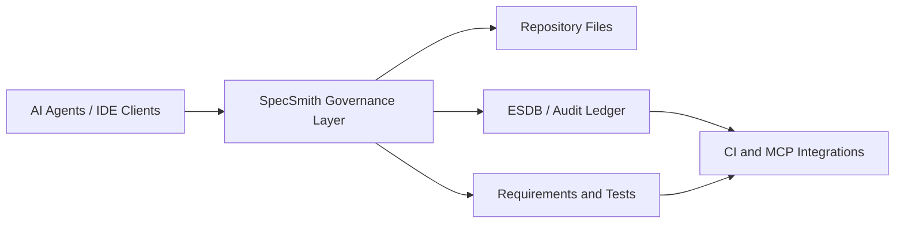

# specsmith

[](https://github.com/layer1labs/specsmith/actions/workflows/ci.yml)
[](https://github.com/sponsors/layer1labs)
[](https://specsmith.readthedocs.io/en/stable/)
[](https://pypi.org/project/specsmith/)
[](https://www.python.org/downloads/)
[](https://github.com/layer1labs/specsmith/blob/main/LICENSE)

SpecSmith is the governance layer for AI-assisted development: it sits between agents and your repo, enforces preflight decisions, and records requirement/test traceability with auditable evidence. It is **not** an IDE, autonomous coding agent, CI runner, or legal-compliance certifier. Use SpecSmith when changes need repeatable controls, work-item lineage, and review-ready artifacts; do not use it for throwaway prototyping where governance overhead is unnecessary. Compared with GitHub Spec Kit, OpenSpec, and BMAD, SpecSmith adds execution-time policy gates and trace chains. Compared with Aider, Claude Code, and Cursor, SpecSmith governs those clients instead of replacing them. Compared with LangGraph and AutoGen, SpecSmith prioritizes software-governance outcomes and evidence quality over general-purpose multi-agent orchestration.

## Architecture at a glance



## When to use / when not to use

- Use when you need governed AI development, auditable decision trails, and requirement-to-test linkage.
- Avoid when rapid local prototyping is the only goal and formal governance is unnecessary.

## Comparison summary

- **GitHub Spec Kit / OpenSpec / BMAD:** strong specification practices; SpecSmith adds execution-time governance, work-item lifecycle control, and trace-chain evidence.
- **Aider / Claude Code / Cursor:** agentic coding interfaces; SpecSmith is the policy and evidence layer around these clients.
- **LangGraph / AutoGen:** orchestration frameworks; SpecSmith is a governance-first development layer with compliance-oriented traceability.

**v0.15.2 — PyPI-safe README links, RTD nav coverage, updated security policy, and expanded embedded skill catalog (Zephyr 4.4→3.x, FreeRTOS, bare-metal C).**
specsmith ships a full compliance and auditability layer aligned to the EU AI Act (2024/1689)
and the NIST AI Risk Management Framework 1.0. Every agent action is cryptographically sealed,
every AI-generated output is disclosed, context windows are GPU-aware and protected against
overflow, and compliance settings are configurable per-session and per-project.

```bash
specsmith governance-serve --port 7700     # governance REST API
specsmith sync                              # sync YAML → JSON → MD (YAML-first mode)
specsmith generate docs                     # regenerate REQUIREMENTS.md + TESTS.md from YAML
specsmith validate --strict                 # YAML schema checks: dup IDs, orphans, coverage
specsmith agent permissions-check git_push # check tool permission (REQ-012)
specsmith ollama gpu                        # detect GPU VRAM, recommend context size
specsmith export                            # generate full compliance report

# Update channel management (REQ-248)
specsmith channel set stable               # pin to stable releases
specsmith channel set dev                  # opt in to dev/pre-release builds
specsmith channel get --json               # show current channel + source

# ESDB extended lifecycle (REQ-249..253)
specsmith esdb export --json               # dump all records to JSON snapshot
specsmith esdb import backup.json          # validate + stage an import
specsmith esdb backup                      # create timestamped snapshot
specsmith esdb rollback --steps 2          # report WAL rollback (stub)
specsmith esdb compact                     # request WAL compaction

# Skills lifecycle (REQ-254..255)
specsmith skills deactivate <skill-id>     # set active=false in skill.json
specsmith skills delete <skill-id> --yes   # permanently remove skill

# MCP config generation (REQ-256)
specsmith mcp generate "Search USPTO patents" --json  # JSON config stub

# Agent ask dispatcher — no LLM required (REQ-257)
specsmith agent ask "show esdb status" --json-output
specsmith agent ask "build skill for summarizing"
```

It also co-installs the standalone `epistemic` Python library for direct use in any project:

```python
from epistemic import AEESession         # works in any Python 3.10+ project
from epistemic import BeliefArtifact, StressTester, CertaintyEngine
```

> **Library vs CLI:** The `specsmith` CLI requires pipx for isolation. The `epistemic` library
> (and `specsmith.esdb`) work in any venv — `pip install specsmith` is all you need for
> library-only use. The pipx guard only fires on CLI invocations.

---

## What is Applied Epistemic Engineering?

AEE treats requirements, decisions, and assumptions — the beliefs your project depends on — as
engineering artifacts subject to the same discipline as code: version control, testing, and refactoring.

**The 4-step core method: Frame → Disassemble → Stress-Test → Reconstruct**

**The 5 foundational axioms:**
1. **Observability** — every belief must be inspectable
2. **Falsifiability** — every belief must be challengeable
3. **Irreducibility** — beliefs decompose to atomic primitives
4. **Reconstructability** — every failed belief can be rebuilt
5. **Convergence** — stress-test + recovery always reaches Equilibrium

---

## The AEE Workflow — 7 Phases

specsmith tracks your project through the full AEE development cycle:

```
🌱 Inception → 🏗 Architecture → 📋 Requirements → ✅ Test Spec
    → ⚙ Implementation → 🔬 Verification → 🚀 Release
```

```bash
specsmith phase          # show current phase + readiness checklist
specsmith phase next     # advance to the next phase (runs checks first)
specsmith phase set requirements  # jump to a specific phase
specsmith phase list     # list all phases
```

The current phase is persisted in `scaffold.yml` as `aee_phase`. Each phase has a checklist
of file/command criteria, recommended commands, and a readiness percentage.

## 1.0 release criteria status

| Criterion | Status | Source |
|---|---|---|
| Stable CLI core contract documented | In progress | `docs/stability.md` |
| Stable generated file schemas documented | In progress | `docs/stability.md` |
| Stable MCP tool schemas documented | In progress | `docs/stability.md` |
| Migration tests linked (#218) | In progress | `docs/roadmap/1.0-criteria.md` |
| Security threat model documented | In progress | `docs/security-threat-model.md` |
| Docs/tutorial/glossary baseline complete | In progress | `docs/roadmap/1.0-criteria.md` |
| Upgrade path and changelog criteria defined | In progress | `docs/roadmap/1.0-criteria.md` |

---

## Install

**Recommended — via pipx (CLI + CI):**

```bash
pipx install specsmith
```

That's it. `specsmith audit`, `preflight`, `sync`, `checkpoint`, `esdb`, `mcp serve`,
and all governance commands work immediately with no additional packages.

> **Want `specsmith run` with a cloud LLM?** Inject the provider SDK only if you use
> the built-in agentic REPL with a cloud API key:
>
> ```bash
> pipx inject specsmith anthropic    # if you set ANTHROPIC_API_KEY
> pipx inject specsmith openai       # if you set OPENAI_API_KEY
> pipx inject specsmith google-genai # if you set GOOGLE_API_KEY
> ```
>
> Ollama works out of the box with no injection — specsmith uses stdlib HTTP.
> For Warp, Claude Code, Cursor, and Copilot, the AI client provides the LLM;
> no injection needed.

**Library-only use (venv / conda / any Python environment):**

```bash
pip install specsmith          # epistemic library + SQLite ESDB — no pipx needed
```

This makes `from epistemic import AEESession` and `from specsmith.esdb import SqliteStore`
immediately importable.  The pipx isolation guard only applies to the `specsmith` CLI
command — not to library imports.  Use this when you want the AEE belief-state machinery
in your own application without managing a pipx environment.

**ESDB — Epistemic State Database**

| Tier | Package | License | What you get |
|------|---------|---------|-------------|
| **Default** | `specsmith` (built-in) | MIT, free | SQLite backend — requirements, test cases, confidence filtering |
| **Commercial** | `chronomemory` via `specsmith[esdb]` | Proprietary — license required | ChronoStore: tamper-evident SHA-256 WAL, OEA anti-hallucination fields, Rust acceleration, epistemic rollback |

See `docs/editions.md` for the full OSS vs commercial feature matrix.

`pip install specsmith` always installs the **free SQLite backend** automatically.
No additional packages, no license key, no configuration — it works out of the box.

```bash
specsmith esdb status   # shows: SQLite (free, MIT) — active by default
```

**ESDB version-control policy (this repository):**
- Commit canonical SQLite state file: `.specsmith/esdb.sqlite3`.
- Commit canonical ChronoMemory state files: `.chronomemory/events.wal` and `.chronomemory/snapshot.json`.
- Do not commit ChronoMemory timestamped backup copies under `.chronomemory/backup/` (regenerated by `specsmith save` / `specsmith esdb backup`).

**Upgrading to chronomemory ChronoStore (commercial):**

If you hold a chronomemory ESDB license, activate the commercial backend:

```bash
# Step 1 — install the chronomemory package
pip install "specsmith[esdb]"                 # installs chronomemory from PyPI
# or if using pipx:
pipx inject specsmith "chronomemory>=0.1.7"  # inject into the specsmith pipx venv

# Step 2 — activate your license key
specsmith esdb enable --key-file /path/to/your.esdb.key
# The key is copied to ~/.specsmith/esdb.key and used automatically from now on.

# Step 3 — verify ChronoStore is active
specsmith esdb status
# ● ESDB — ChronoStore WAL (chronomemory commercial)
#   ✔ License: your-org (expires YYYY-MM-DD)
```

To obtain a chronomemory ESDB license:
[licensing@layer1labs.com](mailto:licensing@layer1labs.com) · [layer1labs.com/esdb-licensing](https://layer1labs.com/esdb-licensing)
See the [full ESDB docs](https://specsmith.readthedocs.io/en/stable/esdb/) for a feature comparison and Python API reference.

**Update:**

```bash
pipx upgrade specsmith
specsmith self-update
```

---

## Quick Start

```bash
# New project (interactive)
specsmith init

# Adopt an existing project
specsmith import --project-dir ./my-project

# Check governance health
specsmith audit --project-dir ./my-project

# Run AEE stress-test on requirements
specsmith stress-test --project-dir ./my-project

# Full epistemic audit (certainty + logic knots + recovery proposals)
specsmith epistemic-audit --project-dir ./my-project

# Start the agentic REPL
specsmith run --project-dir ./my-project

# AG2 agent shell — Planner/Builder/Verifier over Ollama
specsmith agent status                    # check agent config + Ollama
specsmith agent plan "add logging"        # plan only (no execution)
specsmith agent run "fix lint errors"     # full Plan → Build → Verify
specsmith agent improve "add tests"       # self-improvement with reports
specsmith agent verify                    # run Verifier on current state
specsmith agent reports                   # list improvement reports

# Check current AEE workflow phase
specsmith phase --project-dir ./my-project
```

---

## Machine State Sync + YAML Governance

As of v0.11, specsmith uses **YAML-first governance**: `docs/requirements/*.yml`
and `docs/tests/*.yml` are the canonical sources. `REQUIREMENTS.md` and `TESTS.md`
are **generated artifacts** — do not hand-edit them.

```bash
# YAML-first pipeline (v0.11+)
specsmith sync                     # YAML → .specsmith/*.json → docs/*.md (all in one)
specsmith generate docs            # regenerate only the Markdown artifacts from YAML
specsmith generate docs --check    # dry-run: report what would change
specsmith validate --strict        # enforce schema: dup IDs, orphans, missing fields
specsmith validate --strict --json # machine-readable validation result

# CI guard (already in .github/workflows/ci.yml)
specsmith sync --check             # exits 1 if JSON cache is out of sync with YAML
```

**To add a new requirement**, edit the appropriate `docs/requirements/<domain>.yml`
file and run `specsmith sync`. **Never** hand-edit `docs/REQUIREMENTS.md` — it will
be overwritten by the next sync.

**Domain files:**

| File | REQ range | Domain |
|---|---|---|
| `docs/requirements/governance.yml` | REQ-001..064 | Core AEE governance |
| `docs/requirements/agent.yml` | REQ-065..129 | Nexus + CI |
| `docs/requirements/harness.yml` | REQ-130..160 | Slash commands + subagents |
| `docs/requirements/intelligence.yml` | REQ-161..220 | Instinct, eval, memory |
| `docs/requirements/context.yml` | REQ-244..247 | Context window |
| `docs/requirements/esdb.yml` | REQ-248..262 | ESDB + skills + MCP |
| `docs/requirements/ai_intelligence.yml` | REQ-263..299 | AI model intelligence |
| `docs/requirements/yaml_governance.yml` | REQ-300..312 | YAML governance layer |
| `docs/requirements/multiagent_compliance.yml` | REQ-313..320 | Multi-agent governance traceability |
| `docs/requirements/dispatch.yml` | REQ-321..334 | Multi-agent DAG dispatcher |
| `docs/requirements/overflow.yml` | REQ-335..356 | VCS ops, skills catalog, ESDB namespace, session governance, modern web types, Codity.ai integration |

**Migration from Markdown-primary:**
`scripts/migrate_governance_to_yaml.py` once to convert an existing project.
Idempotent — safe to re-run.

## Least-Privilege Agent Permissions (REG-012)

```bash
specsmith agent permissions                      # show active permission profile
specsmith agent permissions-check git_push       # check if git_push is allowed
specsmith agent permissions-check git_push --no-log  # dry-run (no ledger write)
```

Configure in `docs/SPECSMITH.yml`:
```yaml
agent:
  permissions:
    preset: standard       # read_only | standard | extended | admin
    # Or custom:
    allow: [read_file, write_file, run_shell, git_status]
    deny:  [git_push, git_create_pr]
```

---

## AI Compliance & Governance

> **DISCLAIMER — Best-effort only.** specsmith is designed to *help* teams build
> auditable, explainable AI systems, but **it does not guarantee compliance** with
> any law or regulation. Regulations change frequently; final compliance determination
> is solely the responsibility of the end user. Layer1Labs makes no legal warranty.
> Found outdated coverage or a missing regulation?
> [Open a ticket](https://github.com/layer1labs/specsmith/issues) — we actively
> maintain the regulation database and welcome compliance PRs.

specsmith is designed from the ground up for **auditable, explainable, and human-overseen AI**.
It implements concrete compliance mechanisms mapped to the two major regulatory frameworks
that govern AI systems in production today.

### Standards Coverage

**EU AI Act (Regulation 2024/1689)** — The world's first comprehensive legal framework for AI,
enforced across the European Union. High-risk AI systems must provide transparency, auditability,
human oversight, and robustness. specsmith implements:

| EU AI Act Requirement | specsmith Mechanism |
|---|---|
| Art. 9 — Risk Management System | AEE verification loop with confidence scoring and equilibrium checks |
| Art. 12 — Logging & Record-Keeping | `TraceVault` SHA-256 chained ledger (tamper-evident, append-only) |
| Art. 13 — Transparency & Explainability | `ai_disclosure` block in every preflight response; `/why` in Nexus REPL |
| Art. 14 — Human Oversight | Human escalation threshold (`--escalate-threshold`); kill-switch CLI |
| Art. 15 — Accuracy & Robustness | Bounded retry (max 3×), confidence gates, hard context ceiling (REQ-247) |
| Art. 53 — GPAI Model Transparency | Provider + model name emitted in every `ai_disclosure` block |

**NIST AI Risk Management Framework 1.0 (AI RMF)** — The US standard for managing AI risk
across the AI lifecycle. specsmith addresses all four core functions:

| NIST AI RMF Function | specsmith Mechanism |
|---|---|
| **GOVERN** — Policies & accountability | Governance rules (H1–H22), permissions profile, `scaffold.yml` policy |
| **MAP** — Risk identification | AEE stress-test, belief graph, contradictions and uncertainty metrics |
| **MEASURE** — Risk analysis | Confidence scoring, epistemic equilibrium, `specsmith epistemic-audit` |
| **MANAGE** — Risk treatment | Kill-switch, escalation, bounded retry, safe-write backup, permissions deny-list |

### How Each Compliance Mechanism Works

#### 1. Tamper-Evident Audit Log — `TraceVault` (REQ-206)

Every agent action, decision, milestone, and audit gate is recorded as a JSONL entry in
`.specsmith/trace.jsonl`. Each entry contains a SHA-256 hash of its own content plus the
hash of the previous entry, forming a cryptographic chain:

```jsonl
{"seq":1, "type":"DECISION", "description":"...", "hash":"a3f9...", "prev":"genesis"}
{"seq":2, "type":"MILESTONE", "description":"...", "hash":"7c2b...", "prev":"a3f9..."}
```

Any modification to a past entry breaks every subsequent hash. `specsmith trace verify`
detects and reports the first corrupted entry. The file is append-only — overwrites are
blocked by `safe_write`. This satisfies **EU AI Act Art. 12** (logging and record-keeping)
and **NIST AI RMF GOVERN** (accountability trail).

#### 2. AI Disclosure — Every Response (REQ-207)

Every preflight response includes a mandatory `ai_disclosure` block:

```json
{
  "ai_disclosure": {
    "governed_by": "specsmith",
    "governance_gated": true,
    "provider": "ollama",
    "model": "qwen2.5:14b",
    "spec_version": "0.11.4"
  }
}
```

This ensures every AI-generated output is traceable to its source model and version,
meeting **EU AI Act Art. 13** (transparency) and **Art. 53** (GPAI transparency).
It is impossible to suppress — the field is injected at the governance layer before
any response is returned to the client.

#### 3. Human Escalation — Configurable Threshold (REQ-209)

When an action's confidence is below the escalation threshold, specsmith sets
`escalation_required: true` and includes an `escalation_reason` in the preflight payload.
AI clients that support MCP will surface this via the `governance_preflight` tool response.

```bash
specsmith preflight "deploy to production" --escalate-threshold 0.85 --json
# → escalation_required: true, escalation_reason: "confidence 0.71 < threshold 0.85"
```

This implements **EU AI Act Art. 14** (human oversight) and **NIST AI RMF MANAGE**.

#### 4. Kill-Switch — Immediate Session Termination (REQ-210)

A `kill-session` CLI command immediately terminates all active agent sessions and records
a timestamped kill event in `LEDGER.md`:

```bash
specsmith kill-session                   # terminate all sessions, log kill event
specsmith kill-session --session abc123  # terminate a specific session
```

This satisfies **EU AI Act Art. 14 §4** (ability to intervene and stop the AI system)
and is required for certification of high-risk AI systems.

#### 5. Append-Only Safe Write — `safe_write` (REQ-213)

All governance file writes go through `safe_write`, which:
- **Appends** to `LEDGER.md` and `.specsmith/ledger.jsonl` — never truncates
- **Backs up** any file before overwriting it (timestamped `.bak` copy)
- **Prevents** accidental destruction of audit history

This satisfies **EU AI Act Art. 12** (records must be kept for the lifetime of the system)
and provides recovery capability per **NIST AI RMF MANAGE**.

#### 6. Least-Privilege Permissions (REQ-217, REQ-012)

Every agent tool call is gated through a permission profile. Tools outside the active
profile are denied with exit code 3 and a ledger entry:

```bash
specsmith agent permissions-check git_push   # exit 0 = allowed, exit 3 = denied
specsmith agent permissions                  # show active profile
```

Four built-in presets (`read_only`, `standard`, `extended`, `admin`) plus full
custom allow/deny lists in `.specsmith/config.yml`. This implements **NIST AI RMF GOVERN**
(policy enforcement) and principle of least privilege per standard security practice.

#### 7. Policy Guardrails — `is_safe_command` (REQ-220)

Before any shell command is executed, `agent.safety.is_safe_command()` classifies it
against a deny list of destructive patterns (`rm -rf`, `git push origin main`,
`kubectl apply`, `cat .env`, etc.). Denied commands are blocked and logged.
This implements **NIST AI RMF MANAGE** (risk treatment at the action level).

#### 8. Compliance Export Report (REQ-208, REQ-215)

`specsmith export` generates a full compliance report containing:
- **AI System Inventory** — all providers, models, and versions used
- **Risk Classification** — AEE phase, confidence scores, open work items
- **Human Oversight Controls** — active permission profile, escalation settings, kill-switch state
- **Audit Trail Summary** — TraceVault chain length, last verification, any tampering

```bash
specsmith export --format markdown > compliance-report.md
specsmith export --format json > compliance-report.json
```

This report is suitable as a starting point for audit evidence, but is **not a legal
certification**. Always verify with qualified counsel before regulatory submission.

### Compliance per Session and per Project

Compliance settings are layered:

1. **Global defaults** — `~/.specsmith/config.yml` (user-level defaults)
2. **Per-project policy** — `.specsmith/config.yml` (committed to the repo)
3. **Per-session overrides** — CLI flags

Compliance controls include: escalation threshold, permission profile, kill-switch, and
context window settings. Changes take effect immediately and can optionally be written back
to the per-project `.specsmith/config.yml`.

---

## Context Window Management

specsmith enforces safe, efficient use of LLM context windows — especially critical
when running local models via Ollama where the context limit directly affects GPU VRAM.

### GPU-Aware Context Sizing (REQ-244)

```bash
specsmith ollama gpu                    # detect GPU VRAM (NVIDIA + AMD supported)
specsmith ollama available              # show models within your VRAM budget
```

VRAM tiers and recommended context sizes:

| VRAM | Recommended Context |
|---|---|
| < 6 GB (CPU or low-end GPU) | 4,096 tokens |
| 6–11 GB | 8,192 tokens |
| 12–19 GB | 16,384 tokens |
| 20 GB+ | 32,768 tokens |

Override via `SPECSMITH_OLLAMA_CONTEXT_LENGTH` or `ollama.context_length` in `.specsmith/config.yml`.

### Live Context Fill Indicator (REQ-245)

The context fill tracker emits real-time JSONL events:

```jsonl
{"type": "context_fill", "used": 27500, "limit": 32768, "pct": 83.9}
```

When fill reaches the compression threshold (default 80%), specsmith signals that context
summarization should run before the next turn.

### Auto Context Compression (REQ-246)

When fill reaches the compression threshold, specsmith automatically triggers
conversation summarization — the current context is condensed to a compact summary
that preserves key decisions and facts while freeing window space. This happens
transparently before the next agent turn.

Configure in `.specsmith/config.yml`:

```yaml
context:
  compression_threshold_pct: 80   # trigger summarization at 80% fill
  auto_compress: true             # enable automatic compression
```

### Hard Context Ceiling — Never 100% Full (REQ-247)

A hard reservation of **15% of the context window** (minimum 2,048 tokens) is always
held back for the governance layer. Attempts to fill beyond the effective ceiling raise
`ContextFullError` — making it impossible to reach a state where even a compression
request cannot be processed. This is a safety invariant, not a configuration option.

---

## Governance REST API

```bash
# Start the governance REST API (for MCP clients and IDE integrations)
specsmith governance-serve --port 7700 --project-dir .

# Classify a natural-language utterance under Specsmith governance
specsmith preflight "fix the cleanup dry-run regression" --json

# Start the agentic REPL
specsmith run
> what does the cleanup module do?           # read-only ask -> answered
> fix the cleanup dry-run regression          # change -> Specsmith approves, runs
> delete the entire dist directory            # destructive -> needs clarification
```

---

## Work Item (WI) Lifecycle

Every accepted `specsmith preflight` mints a **Work Item** — a unique ID such as
`WI-3A9F1C02` that tracks user intent through the full governance lifecycle.
WIs are persisted to `.specsmith/workitems.json` and evolve through defined states:

| State | Meaning |
|---|---|
| `open` | Minted by preflight; work in progress |
| `implemented` | `specsmith verify` reached equilibrium (auto-set) |
| `promoted` | Elevated to a formal REQ-NNN via `specsmith wi promote` |
| `closed` | Done; maps to an existing requirement |
| `archived` | Deferred; may be re-opened |
| `rejected` | Explicitly rejected |

```bash
# See all open work items
specsmith wi list --status open

# View full details of a WI
specsmith wi show WI-3A9F1C02

# Close a WI (change covered by an existing REQ)
specsmith wi close WI-3A9F1C02 --reason "covered by REQ-042"

# Promote a WI to a new requirement (new behaviour, no existing REQ)
specsmith wi promote WI-3A9F1C02 \
    --title "System must retry on transient HTTP 5xx failures" \
    --domain governance
specsmith sync   # regenerate REQUIREMENTS.md

# Set kind label
specsmith wi tag WI-3A9F1C02 --kind bug

# Import historical WIs from LEDGER.md
specsmith wi import --from-ledger
```

**When to promote vs close:** Promote (`wi promote`) when the change introduces new
behaviour not covered by any existing REQ and the pattern is expected to recur.
Close (`wi close`) for bug fixes, refactors, and chores that already have a matching REQ.

Full documentation: [`docs/site/wi-lifecycle.md`](https://specsmith.readthedocs.io/en/stable/wi-lifecycle/)

---

## Nexus

The Nexus runtime is specsmith's local-first agentic REPL — a
governance-gated broker that sits between you and the LLM.

Every utterance passes through `specsmith preflight` before execution.
The broker classifies intent, matches requirements, and gates the action.
After execution, `specsmith verify` checks equilibrium. The `/why` command
shows the full governance trace.

```bash
# Interactive REPL with governance
specsmith run
nexus> fix the cleanup bug         # broker classifies → accepts → executes → verifies
nexus> /why                         # show governance trace for last action
nexus> /exit
```

The Nexus broker:
- **Preflight gate**: every change goes through `specsmith preflight`
- **Bounded retry**: failed actions retry up to 3× with strategy classification
- **Execution trace**: every action is sealed in the cryptographic trace vault
- **`/why` toggle**: shows governance rationale in human-readable form

**How it works.** A natural-language **broker** classifies intent, infers scope from
your requirements, and asks Specsmith to **preflight** the request. Only when the
preflight decision is `accepted` does Nexus drive the AG2 orchestrator — and it does so
through a **bounded-retry harness** so you can never accidentally run away. By default,
Nexus speaks plain English; toggle `/why` in the REPL to surface the underlying
requirement, test, and work-item identifiers Specsmith assigned.

**Pieces in this repo.**
- `specsmith preflight` — CLI subcommand emitting a deterministic governance JSON payload
  (`decision`, `requirement_ids`, `test_case_ids`, `confidence_target`, `instruction`).
- `src/specsmith/agent/broker.py` — natural-language broker (intent + scope + narration).
- `src/specsmith/agent/repl.py` — Nexus REPL with the `/why` toggle and execution gate.
- `docker-compose.yml` — pinned vLLM `l1-nexus` model server with the Hermes tool-call parser.
- `scripts/nexus_smoke.py` — opt-in live smoke test (`NEXUS_LIVE=1` to run against
  a running container).

---

## AI Model Intelligence

specsmith ships a complete AI model intelligence layer for tracking, scoring, and routing
to the best available LLM for each task type.

### HF Open LLM Leaderboard Sync (REQ-263..REQ-269)

Syncs benchmark data from the HuggingFace Open LLM Leaderboard and computes three
task-specific bucket scores — **reasoning**, **conversational**, and **longform** — for
every model. A 40+ model static fallback ensures scores are always available even without
network access.

```bash
specsmith model-intel sync                  # sync from HF leaderboard (static fallback if offline)
specsmith model-intel scores                # list all cached bucket scores
specsmith model-intel scores --model gpt-4o # show scores for a specific model
specsmith model-intel recommendations       # top-10 models for reasoning bucket
specsmith model-intel recommendations --bucket conversational  # or longform
specsmith model-intel connection            # test HF API connectivity + token status
```

Set `SPECSMITH_HF_TOKEN` for authenticated access (1000 req/5min instead of 500).
Scores persist to `~/.specsmith/model_scores.json`. Background sync runs 15s after startup
then daily.

**Bucket formulas (normalised 0-100):**
- Reasoning = 0.35×MATH + 0.30×GPQA + 0.25×BBH + 0.10×IFEval
- Conversational = 0.40×IFEval + 0.35×MMLU-PRO + 0.25×BBH
- Longform = 0.35×MUSR + 0.35×IFEval + 0.30×MMLU-PRO

### Model Capability Profiles (REQ-270..REQ-271)

40+ pre-built model profiles cover all major providers (OpenAI, Anthropic, Google, Mistral,
Meta Llama, Qwen, DeepSeek, and local Ollama variants). Each profile specifies:
`max_tokens`, `prompt_style` (sections/xml/markdown), `supports_vision`,
`supports_tool_calls`, `reasoning_mode`, and `context_window`.

Context-aware history trimming preserves system messages while summarising older turns when
the token budget is exceeded:

```python
from specsmith.agent.model_profiles import get_profile, trim_history

profile = get_profile("qwen2.5:14b")   # exact or prefix match; returns default if unknown
messages = trim_history(messages, budget_chars=12000)
```

### LLM Client with Provider Fallback (REQ-275..REQ-277)

`LLMClient` wraps multiple providers with automatic fallback on 429 / 401 errors,
O-series parameter translation (`max_completion_tokens`, temperature=1, developer role),
and vLLM guided-JSON payload injection:

```python
from specsmith.agent.llm_client import LLMClient

client = LLMClient([
    {"provider_type": "cloud", "model": "gpt-4o", ...},
    {"provider_type": "ollama", "model": "qwen2.5:14b", ...},  # local fallback
])
result = client.chat([{"role": "user", "content": "hello"}])
```

### Endpoint Presets + Suggest Profiles (REQ-278..REQ-280)

A registry of 10+ pre-configured endpoint presets for common cloud and local LLM providers:

```bash
specsmith agent endpoint-presets            # list all presets (vllm, lm_studio, openrouter, etc.)
specsmith agent endpoint-presets --json     # machine-readable output
specsmith agent suggest-profiles            # suggest optimal profiles based on env (API keys, hardware)
specsmith agent suggest-profiles --json     # structured suggestions with bucket/role annotations
```

Suggestions are read-only (never persisted) and inspect `OPENAI_API_KEY`, `ANTHROPIC_API_KEY`,
`GOOGLE_API_KEY`, and local Ollama availability.

---

## Multi-Agent DAG Dispatcher (REQ-321..334)

The `specsmith dispatch` command group decomposes a task into a **Directed Acyclic Graph** of
agent work items and executes them concurrently, with fail-forward BLOCKED propagation and
ESDB context injection between nodes.

```bash
# Run a task through the DAG dispatcher (default: up to 4 concurrent workers)
specsmith dispatch run "add API endpoint with tests" --max-workers 4

# Stream JSONL events while the run is in progress
specsmith dispatch run "refactor auth module" --json

# Check status of a saved run
specsmith dispatch status --dag-id abc123def456

# List all saved runs
specsmith dispatch list

# Retry a single failed node from a checkpoint
specsmith dispatch retry --node impl --dag-id abc123def456
```

The dispatcher is also available programmatically:

```python
from specsmith.agent.orchestrator import Orchestrator

orchestrator = Orchestrator()

# Use the DAG path (falls back to GroupChat on cycle detection)
result = orchestrator.run_task("add feature X", use_dag=True)

# Always use DAG — returns DispatchSummary with per-node outcomes
summary = orchestrator.run_dispatch(
    "add feature X",
    planner_output=[
        {"id": "arch", "title": "Design", "role": "architect", "depends_on": []},
        {"id": "impl", "title": "Implement", "role": "coder", "depends_on": ["arch"]},
        {"id": "test", "title": "Write tests", "role": "tester", "depends_on": ["arch"]},
    ],
    max_workers=3,
)
print(f"{len(summary.completed)} completed, {len(summary.failed)} failed")
```

Events are persisted to `.specsmith/dispatch/<dag_id>/events.jsonl` for resume and replay.

---

## Compiler and Tool Support

All agent roles can invoke compiler, linter, and formatter tools. These are registered in
`AVAILABLE_TOOLS` and wired into `ROLE_TOOLS` for the `coder`, `reviewer`, `tester`, `architect`,
and `embedded-coder` roles.

| Tool | Function | Default binary |
|------|----------|-|
| GCC / G++ | `run_gcc(args, compiler='gcc')` | `gcc` / `g++` |
| ARM bare-metal | `run_arm_gcc(args, compiler='arm-none-eabi-gcc')` | `arm-none-eabi-gcc` |
| AArch64 Linux | `run_aarch64_gcc(args, compiler='aarch64-linux-gnu-gcc')` | `aarch64-linux-gnu-gcc` |
| IAR Embedded | `run_iar_compiler(project_file, executable='IarBuild')` | `IarBuild` |
| Intel oneAPI | `run_intel_compiler(args, compiler='icx')` | `icx` / `icpx` / `icc` |
| clang-format | `run_clang_format(files, style='file', in_place=False)` | `clang-format` |
| clang-tidy | `run_clang_tidy(files, checks='', fix=False)` | `clang-tidy` |
| VSG (VHDL) | `run_vsg(files, rules=None, fix=False)` | `vsg` |

All tools are usable directly in the agentic REPL and in `specsmith dispatch` worker nodes:

```python
from specsmith.agent.tools import run_arm_gcc, run_clang_tidy, run_vsg

# Cross-compile for ARM bare-metal
result = run_arm_gcc("-Wall -O2 main.c -o firmware.elf", compiler="arm-none-eabi-gcc")

# Lint C/C++ with clang-tidy
result = run_clang_tidy("src/", checks="modernize-*,readability-*")

# Style-check VHDL files
result = run_vsg("rtl/top.vhd", rules="vsg_rules.yaml")
```

---

## Supporting specsmith

specsmith is open source and built by a small team. Every bit of support helps:

- ⭐ **Star** [specsmith](https://github.com/layer1labs/specsmith) on GitHub
- 📣 **Tell your friends and colleagues** — word of mouth is our best marketing
- 🐛 **Report bugs** via [GitHub Issues](https://github.com/layer1labs/specsmith/issues) — even small ones help
- 💡 **Suggest features** via [GitHub Discussions](https://github.com/layer1labs/specsmith/discussions) — we read every suggestion
- 🔧 **Fix bugs and contribute** — see [CONTRIBUTING.md](https://github.com/layer1labs/specsmith/blob/main/CONTRIBUTING.md); PRs welcome
- 📝 **Write about specsmith** — blog posts, tutorials, and talks help the community grow
- ❤️ **[Sponsor layer1labs](https://github.com/sponsors/layer1labs)** — directly funds development

---

## Ollama — Local LLMs (Zero API Cost)

specsmith has first-class Ollama support, including:

```bash
specsmith ollama gpu                    # detect GPU and VRAM tier
specsmith ollama available              # show catalog filtered by VRAM budget
specsmith ollama available --task code  # filter by task type
specsmith ollama pull qwen2.5:14b      # download a model
specsmith ollama suggest requirements  # task-based recommendations
specsmith ollama list                  # show installed models
```

GPU-aware context sizing: 4K/8K/16K/32K tokens based on detected VRAM.
Override via `SPECSMITH_OLLAMA_CONTEXT_LENGTH` env var or `ollama.context_length` in `.specsmith/config.yml`.

---

## FPGA / HDL Projects

specsmith supports FPGA-specific project types with full governance:

```yaml
# scaffold.yml
type: fpga-rtl-amd          # or fpga-rtl-intel / fpga-rtl-lattice / fpga-rtl
fpga_tools:
  - vivado
  - gtkwave
  - vsg
  - ghdl
  - verilator
```

Supported tools: **Synthesis:** vivado, quartus, radiant, diamond, gowin.
**Simulation:** ghdl, iverilog, verilator, modelsim, questasim, xsim.
**Waveform:** gtkwave, surfer. **Linting:** vsg, verible, svlint.
**Formal:** symbiyosys. **OSS flow:** yosys, nextpnr, openFPGALoader.

---

## 50+ CLI Commands

**Governance:** `init` `import` `audit` `validate` `diff` `upgrade` `compress` `doctor` `export` `architect`

**AEE Epistemic:** `stress-test` `epistemic-audit` `belief-graph` `trace seal/verify/log`

**Workflow:** `phase show/set/next/list` `ledger add/list` `req list/add/gaps/trace`

**Work Items:** `wi list` `wi show` `wi close` `wi archive` `wi promote` `wi tag` `wi import`

**Agent:** `run` `agent run/plan/status/verify/improve/reports` `agent providers/tools/skills` `agent suggest-profiles` `agent endpoint-presets`

**Dispatch:** `dispatch run` `dispatch status` `dispatch list` `dispatch retry`

**Model Intel:** `model-intel sync` `model-intel scores` `model-intel recommendations` `model-intel connection`

**Ollama:** `ollama list/available/gpu/pull/suggest`

**Workspace:** `workspace init/audit/export`

**Integrations:** `integrate codity` `integrate claude-code` `integrate cursor` `integrate copilot` `integrate aider` `integrate gemini` `integrate windsurf` `integrate agent-skill`

**VCS:** `commit` `push` `pull` `save` `load` `sync` `branch` `pr` `status` `checkpoint`

**Tools:** `tools scan [--fpga]` `tools install <tool>` `tools rules [--tool] [--list]`

**Session & Process:** `exec` `ps` `abort` `watch` `credits` `self-update` `kill-session` `session-end`

**Auth:** `auth set/list/remove/check`

**Patent:** `patent search/prior-art`

---

## 64 Project Types

**Python:** `cli-python`, `library-python`, `backend-frontend`, `backend-frontend-tray`, `embedded-python-hmi`, `research-python`.

**Systems languages:** `cli-rust`, `library-rust`, `cli-go`, `cli-c`, `library-c`, `dotnet-app`.

**Modern web:** `web-frontend`, `fullstack-js`, `nextjs-app`, `nuxt-app`, `sveltekit-app`, `remix-app`, `astro-site`.

**AI / Agents:** `llm-app`, `agent-orchestration`, `mcp-server`, `rag-pipeline`, `mlops-platform`.

**JVM:** `java-spring`, `java-library`.

**Mobile:** `mobile-app`.

**Infrastructure:** `serverless`, `kubernetes-operator`, `microservices`, `devops-iac`, `streaming-pipeline`, `data-warehouse`, `data-ml`.

**Game development:** `game-unity`, `game-godot`.

**Web3:** `smart-contract`.

**Desktop:** `desktop-electron`, `desktop-tauri`.

**Hardware / Embedded:** `fpga-rtl`, `fpga-rtl-amd`, `fpga-rtl-intel`, `fpga-rtl-lattice`, `mixed-fpga-embedded`, `mixed-fpga-firmware`, `yocto-bsp`, `embedded-hardware`, `pcb-hardware`, `safety-critical`.

**Documents & IP:** `spec-document`, `user-manual`, `research-paper`, `research-python`, `api-specification`, `requirements-mgmt`, `patent-application`, `patent-prosecution`.

**Business / Legal / AEE:** `business-plan`, `legal-compliance`, `monorepo`, `browser-extension`, `epistemic-pipeline`, `knowledge-engineering`, `aee-research`.

**Declarative / Formal:** `brief-lang` (Brief v0.14.0 — contract-enforced logic language, `.bv`/`.sbv`/`.ebv`/`.rbv`).

---

## epistemic Library

The standalone `epistemic` Python library works in any Python 3.10+ project — no specsmith coupling:

```python
from epistemic import AEESession, BeliefArtifact, StressTester

session = AEESession("my-project", threshold=0.70)
session.add_belief(
    artifact_id="HYP-001",
    propositions=["The API always returns valid JSON"],
    epistemic_boundary=["Valid auth token required"],
)
session.accept("HYP-001")
result = session.run()
print(result.summary())
# certainty=0.55, failures=2, equilibrium=False
```

Use cases: linguistics research, compliance pipelines, AI alignment, patent prosecution.

---

## Governance Rules (H1–H22)

22 hard rules enforced by `specsmith validate` and `specsmith audit`.
Full rule text: [`docs/governance/RULES.md`](https://github.com/layer1labs/specsmith/blob/main/docs/governance/RULES.md)

**H1–H14 — Core engineering and traceability rules:**
- **H1** — No ledger entry = work not done.
- **H2** — No proposal = no execution.
- **H3** — All work must consider every target platform.
- **H4** — No system-dependent assumptions; virtual environments required.
- **H5** — No hidden service logic.
- **H6** — If the task grows beyond the proposal, stop and re-propose.
- **H7** — Every state change must be traceable and recorded.
- **H8** — Architecture changes MUST update docs in the same work cycle.
- **H9** — Every agent command must have a timeout.
- **H10** — No hardcoded version strings outside `pyproject.toml`.
- **H11** — Every loop must have a deadline; no unbounded blocking I/O.
- **H12** — Platform-aware automation: sh/bash on Unix, `.cmd`/`.ps1` on Windows.
- **H13** — Every proposal must declare its epistemic boundaries and assumptions.
- **H14** — Documentation must be updated in the same work cycle as code changes.

**H15–H22 — Anti-hallucination and epistemic stability (OEA framework):**

Rules H15–H22 are derived from the *"Ontology-Epistemic-Agentic (OEA) Recursive
Generative Stability"* study (Layer1Labs Research, 2026), which empirically validated
the primary control mechanisms for preventing hallucination and semantic drift in
production LLM systems:

- **H15** — Epistemic scope bounding: no claims outside verified knowledge; say "unknown" rather than fabricate.
- **H16** — Anti-drift recursion guard: max 5 autonomous generation steps before a human checkpoint.
- **H17** — Calibration direction: express uncertainty, not false confidence.
- **H18** — RAG retrieval filtering: validate context relevance (similarity ≥ 0.6) before injection.
- **H19** — Synthetic contamination prevention: never mix synthetic and real data silently.
- **H20** — Falsifiability required: cite sources or flag claims as `[HYPOTHESIS]`.
- **H21** — Disclose all model-specific assumptions (context window, format, temperature).
- **H22** — Cross-platform CI: green on one OS ≠ cross-platform coverage.

---

## Codity.ai AI Code Review Integration

specsmith can scaffold [Codity.ai](https://codity.ai) AI code review into any project:

```bash
specsmith integrate codity --project-dir ./my-project
```

This generates:
- `.github/workflows/codity-review.yml` (GitHub Actions) or `.gitlab-ci-codity.yml` / `.azure-pipelines/codity-review.yml` depending on your VCS
- `docs/codity-setup.md` — one-time setup checklist
- Appends a TODO checklist to `LEDGER.md`

**Windows note:** Codity's `install.sh` is Linux/macOS only. For native PowerShell use, install `codity.exe` from the official `codity-ai/codity-cli` GitHub release zip and place it on PATH (for example `~/.local/bin`).

**AGENTS.md rule (REQ-355):** Projects with Codity configured SHOULD run `codity review --staged` before any commit touching production code. HIGH-severity findings are blocking; MEDIUM findings require inline acknowledgement.

See the `codity-ai-review` governance skill (`specsmith skill install codity-ai-review`) for the full CLI workflow reference.

---

## Skills

specsmith ships **136 built-in skills** across 16 domains that AI agents (Warp, Claude Code, Codex, Cursor) can install and use.

```bash
# List all available skills
specsmith skill list

# Search by keyword
specsmith skill search zephyr

# Install a skill into .agents/skills/
specsmith skill install specsmith
specsmith skill install specsmith-save
specsmith skill install specsmith-audit
```

Skills are installed as `.agents/skills/<slug>/SKILL.md` and are auto-discovered by any AI tool that scans `.agents/skills/`.

### Skill domains

| Domain | Count | Coverage |
|--------|-------|----------|
| `governance` | 20 | AEE workflows, verification, release, CI polling, patent prosecution, client integrations |
| `ai-agents` | 14 | LLM apps, MCP servers, agent orchestration, RAG, prompt engineering, fine-tuning, MLOps |
| `software-engineering` | 13 | Code review, TDD, debugging, security hardening, API design, ADRs, Brief lang |
| `web-backend` | 11 | Frontend UI, Next.js, REST/GraphQL, PostgreSQL, Redis, WebSockets |
| `platform-engineering` | 10 | Helm, observability, GitOps, secrets, OAuth2, chaos engineering |
| `embedded` | 11 | Zephyr, Yocto, FreeRTOS, bare-metal C, NuttX, Buildroot, Azure RTOS |
| `docs` | 10 | MkDocs, Sphinx, Doxygen, JSDoc, OpenAPI, mdBook |
| `data-engineering` | 8 | ETL/ELT, dbt, Spark, data quality, feature stores, Delta Lake |
| `hardware` | 9 | KiCad, Altium, Vivado, Quartus, GTKWave, JTAG |
| `corporate` | 7 | Budgets, fundraising, marketing, HR, legal |
| `devops` | 6 | Docker, Kubernetes, Terraform, GitHub Actions |
| `cloud` | 4 | AWS, Azure, GCP, GitHub CLI |
| `mobile` | 4 | iOS, Android, Flutter, React Native |
| `ssh` | 3 | SSH, WSL2, remote dev |
| `cross-platform` | 3 | CMake, package managers, terminal awareness |
| `productivity` | 3 | Email, presentations, MS Office |

### Self-referential governance skills

Three skills document specsmith itself:

| Slug | Purpose |
|------|--------|
| `specsmith` | Master CLI reference — session workflow, commands, audit codes |
| `specsmith-save` | When and how to run `specsmith save` |
| `specsmith-audit` | Running audits and interpreting results |

### Remote reference (Warp Oz cloud agents)

```bash
oz agent run-cloud --skill "layer1labs/specsmith:specsmith-save" --prompt "save my work"
```

---

## Warp Terminal Integration (v0.13.0)

specsmith ships native integration with [Warp](https://www.warp.dev) terminal — both as
an MCP server and as repository workflows.

### Native MCP Governance Server

`specsmith mcp serve` starts a zero-dependency stdio MCP server (JSON-RPC 2.0, MCP 2024-11-05).
Warp/Oz, Cursor, Claude Code, or any other MCP client can call governance commands as structured
tool calls — no shell roundtrip, fully typed inputs and outputs.

**Setup (one time):**

```bash
# Get the Warp config snippet
specsmith mcp install-warp
```

Copy the output JSON into **Warp Settings → Agents → MCP servers**. Or pass it inline:

```bash
oz agent run --mcp '{"specsmith-governance": {"command": "specsmith", "args": ["mcp", "serve"]}}' \
  --prompt "check governance health and preflight my next change"
```

**Six MCP tools exposed:**

| Tool | What it returns |
|---|---|
| `governance_audit` | Full audit health JSON — passed/failed checks, fixable count |
| `governance_checkpoint` | GOVERNANCE ANCHOR snapshot — phase, health, REQ/TEST counts, ESDB chain |
| `governance_preflight` | Preflight decision — `accepted`/`needs_clarification` + `work_item_id` |
| `governance_phase` | Current AEE phase, readiness %, failing checks |
| `governance_req_list` | All requirements with status + test coverage, filterable |
| `governance_trace_seal` | Create a cryptographic trace vault seal |

### Repository Workflows (Ctrl+Shift+R)

Clone this repo and open it in Warp — seven governance workflows appear automatically in
`Ctrl+Shift+R` search:

| Workflow | Command |
|---|---|
| specsmith — Session Start | Full bootstrap: kill → migrate → audit → sync → checkpoint |
| specsmith — Audit | `specsmith audit` |
| specsmith — Checkpoint | `specsmith checkpoint` (emits GOVERNANCE ANCHOR) |
| specsmith — Preflight | `specsmith preflight "{{intent}}" --json` |
| specsmith — Save | `specsmith save` |
| specsmith — Phase Status | `specsmith phase show` |
| specsmith — Session End | `specsmith save && specsmith kill-session` |

---

## The specsmith Bootstrap

specsmith governs itself — the specsmith repo is a specsmith-managed project. Run `specsmith audit`
in this repo to check its governance health. This means every feature we add to specsmith is
immediately dogfooded on specsmith itself.

## Documentation

**[specsmith.readthedocs.io](https://specsmith.readthedocs.io)** — Full manual: AEE primer,
command reference, project types, tool registry, governance model, ESDB, skills integrations, Ollama guide.

## Links

- [PyPI](https://pypi.org/project/specsmith/)
- [Documentation](https://specsmith.readthedocs.io)
- [Stability Contract](https://github.com/layer1labs/specsmith/blob/main/docs/stability.md)
- [1.0 Release Criteria](https://github.com/layer1labs/specsmith/blob/main/docs/roadmap/1.0-criteria.md)
- [Editions Matrix](https://github.com/layer1labs/specsmith/blob/main/docs/editions.md)
- [Changelog](https://github.com/layer1labs/specsmith/blob/main/CHANGELOG.md)
- [Contributing](https://github.com/layer1labs/specsmith/blob/main/CONTRIBUTING.md)
- [Roadmap](https://github.com/layer1labs/specsmith/blob/main/ROADMAP.md)
- [Compatibility Matrix](https://github.com/layer1labs/specsmith/blob/main/docs/site/compatibility.md)
- [Product Principles](https://github.com/layer1labs/specsmith/blob/main/docs/product-principles.md)
- [Security](https://github.com/layer1labs/specsmith/blob/main/SECURITY.md)

## License

MIT — Copyright (c) 2026 Layer1Labs Silicon, Inc.
