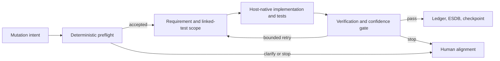

# Specsmith system architecture

## Purpose

Specsmith governs AI-assisted changes with the smallest useful AEE kernel:
requirements tracking, linked-test enforcement, deterministic preflight,
epistemic context compression, verification, and durable evidence.

## Components

### Canonical governance sources

- `docs/requirements/*.yml` — behavior and acceptance scope.
- `docs/tests/*.yml` — test cases linked to requirement IDs.
- `docs/governance/*.md` and `.yml` — project policy and session protocol.
- `LEDGER.md` — human-readable append-only decision history.

`.specsmith/requirements.json` and `.specsmith/testcases.json` are derived caches,
not alternate sources of truth. `specsmith sync` rebuilds them and repairs
supported older formats without discarding accepted records.

### Deterministic governance

`specsmith.agent.broker` classifies an utterance and infers requirement scope.
`specsmith.governance_logic` applies the decision policy, allocates project-scoped
work-item IDs, and wires accepted scope to linked tests. Destructive, release, or
unclear work escalates instead of silently passing.

Verification consumes observed evidence: changed files, native test results,
review comments, requirement links, and confidence. Bounded retry strategies can
request a smaller scope or corrected tests, but they cannot convert a failed gate
into success.

### Context and evidence

`checkpoint` emits a compact anchor containing phase, active work, requirement and
test counts, and health. The context orchestrator keeps relevant requirements,
tests, decisions, unknowns, and evidence while compressing older narration.

The free default ESDB uses SQLite. The optional ChronoMemory backend adds its
licensed ChronoStore implementation. Both expose the same Specsmith evidence
boundary so integrations do not depend on a proprietary backend.

### Interfaces

- The focused CLI supports project adoption, requirements, tests, preflight,
  verification, audit, context, evidence, integrations, and diagnostics.
- MCP and generated host adapters carry the AEE contract into an existing agent.
- Zoo/Roo Code setup merges managed configuration and repairs malformed or older
  Specsmith-owned entries while preserving user settings and secrets.
- Grace provides a local terminal fallback using the same governance services.

### Host responsibility

Specsmith deliberately delegates code editing, Git hosting, browsers, deployment,
framework expertise, and generic skills to the host agent or developer tools.
Those operations return evidence to Specsmith; they are not duplicated inside the
governance layer.

## End-to-end flow

## Invariants

1. No mutation proceeds without accepted preflight scope.
2. Every accepted requirement has linked test evidence.
3. Machine caches never outrank canonical governance sources.
4. Compression preserves epistemic status and provenance.
5. Host/model claims do not become facts without observed evidence.
6. Managed configuration repair never overwrites unrelated user configuration.
7. Windows, Linux, and macOS use equivalent paths and command semantics.
8. Specsmith publication occurs only through reviewed release branches and
   repository-local CI.

## Release architecture

A release candidate synchronizes package, project, and governance versions;
builds an sdist and a wheel derived from that sdist; installs the wheel in an
isolated environment; applies candidate governance; and requires a clean second
pass. The approved main commit is tagged once. GitHub Releases and PyPI receive
the same immutable artifacts, and a post-publication receipt links them to the
pre-release seal.
