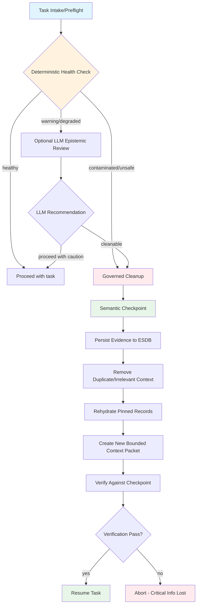
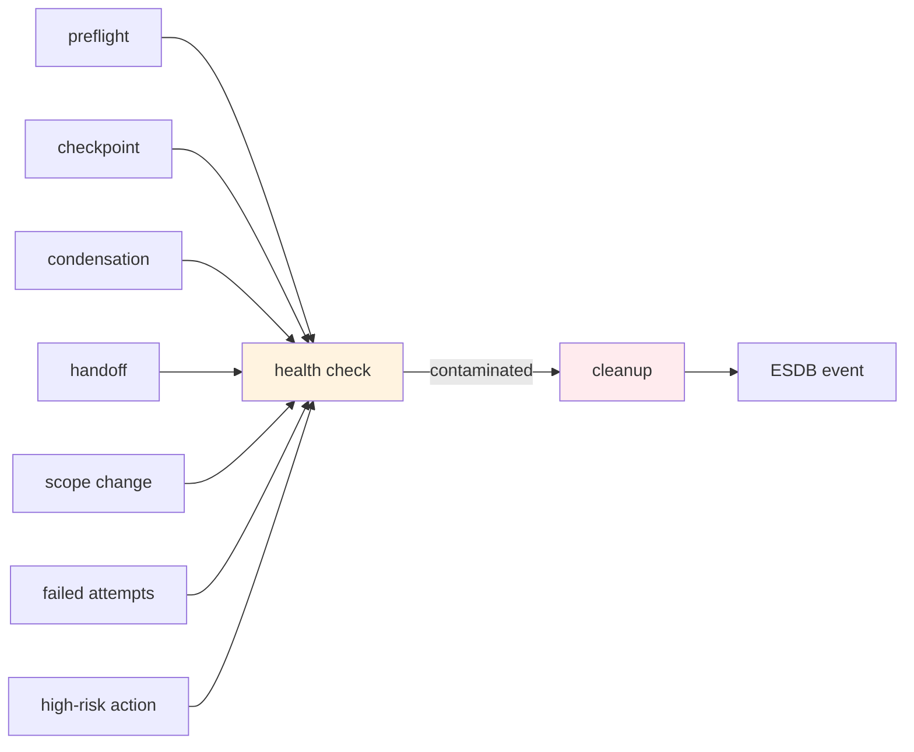

# Epistemic Context-Health Checks

**Issue:** [#334](https://github.com/layer1Labs/specsmith/issues/334)
**Phase:** Architectural decision record
**Status:** Proposed
**Dependencies:** #332 (predictive context-risk preflight), #333 (ESDB context residency)

## Overview

This document defines a proactive context-health subsystem that detects contamination, stale assumptions, contradictions, duplication, provenance gaps, and task-irrelevant residue before they degrade agent decisions. It provides a governed cleanup path that preserves authoritative evidence in ESDB/ledgers while rebuilding a clean, bounded working context.



## Context Contamination Definition

The active model context is treated as contaminated when one or more of these conditions are present:

| Contamination Type | Description | Detection Method |
|---|---|---|
| Stale facts | Superseded by newer authoritative evidence | Source digest/version/commit comparison |
| Contradictory claims | Unlabeled conflicts between records | Identity/scope-based comparison |
| Speculative as fact | Inferred claims presented as accepted | Provenance confidence check |
| Missing provenance | Summaries with unverifiable sources | Source ID validation |
| Omitted constraints | User constraints weakened/missing | Constraint inventory check |
| Task residue | Completed/abandoned tasks still influencing | Work-item state check |
| Duplicate context | Same source/summary duplicated | Content digest comparison |
| Stale errors | Old results after underlying state changed | File metadata/version check |
| Untrusted instructions | External/agent instructions competing with repo authority | Source precedence validation |
| Broken references | File/branch/version references no longer match | Git state validation |
| Context crowding | Excessive low-value context | Token budget analysis |

## Required Components

### 1. ContextHealthReport Structure

```python
@dataclass
class ContextHealthReport:
    """Structured report of context health status."""
    
    # Overall status
    status: Literal["healthy", "warning", "degraded", "contaminated", "unsafe"]
    
    # Token budget
    context_pressure: float  # 0.0-1.0, fraction of context used
    token_budget: int  # Available tokens
    
    # Authoritative constraints
    authoritative_constraints_present: list[str]
    authoritative_constraints_missing: list[str]
    
    # Findings
    duplicate_groups: list[DuplicateGroup]
    stale_records: list[StaleRecord]
    contradictions: list[Contradiction]
    unsupported_claims: list[UnsupportedClaim]
    provenance_gaps: list[ProvenanceGap]
    task_irrelevant_residue: list[ResidueItem]
    source_of_truth_mismatches: list[Mismatch]
    
    # Recommendations
    recommended_cleanup_actions: list[str]
    pinned_records: list[str]  # Must remain in context
    
    # Metrics
    metrics: ContextHealthMetrics
```

### 2. Health Metrics

```python
@dataclass
class ContextHealthMetrics:
    """Explainable component metrics for context health."""
    
    authority_coverage: float  # Fraction of claims with authoritative source
    provenance_coverage: float  # Fraction of claims with verifiable provenance
    contradiction_burden: int  # Number of unresolved contradictions
    stale_context_ratio: float  # Fraction of stale context
    duplicate_token_ratio: float  # Fraction of tokens in duplicates
    active_task_relevance_ratio: float  # Fraction relevant to active task
    unresolved_risk_coverage: float  # Fraction of risks documented
    checkpoint_integrity: bool  # Last checkpoint verifiable
    compression_loss_indicators: list[str]  # Lost facts during compression
    available_headroom_after_cleanup: int  # Estimated tokens after cleanup
```

### 3. Health Check Triggers

Deterministic health checks run at these boundaries:

| Trigger | Frequency | Cost |
|---|---|---|
| Task intake/preflight | Per task | Cheap |
| After semantic checkpoint creation | Per checkpoint | Cheap |
| After condensation | Per condensation | Cheap |
| After fresh-task handoff | Per handoff | Cheap |
| When scope changes | Per scope change | Cheap |
| After three failed attempts | Per failure cluster | Cheap |
| Before high-risk actions | Per action | Cheap |
| Optional LLM epistemic review | Gated | Expensive |

### 4. Authoritative Source Precedence

Context is validated against sources in this order:

1. Current explicit user instruction
2. Accepted proposal and active work item
3. Repository governance/rules
4. Requirements/tests/architecture and current code state
5. Verified tool/test evidence
6. Durable ESDB records with provenance/confidence
7. Summaries/handoffs
8. Unverified inference

### 5. Contradiction Detection

- Use identity and scope rather than string similarity alone
- Preserve both sides as evidence
- Mark unresolved conflicts explicitly
- Never silently choose one side

### 6. Staleness Detection

- Use source digest/version/commit/file metadata
- Record supersession edges in ESDB
- Flag records whose source has changed

### 7. Missing Invariant Detection

After condensation, check for:

- Exact user constraints
- Acceptance criteria
- Destructive-action boundaries
- Unresolved risks
- Changed files
- Next action

### 8. Governed Cleanup Operation

```python
def cleanup_context(
    work_item_id: str,
    dry_run: bool = False,
    strategies: list[str] | None = None,
) -> CleanupReport:
    """Governed context cleanup with dry-run and apply modes.
    
    Steps:
    1. Create semantic checkpoint first
    2. Persist all important active evidence to ESDB
    3. Remove duplicate and irrelevant resident context only
    4. Exclude stale/superseded items without deleting durable evidence
    5. Rehydrate pinned/current records from authoritative sources
    6. Create new bounded context packet and digest
    7. Verify rebuilt packet against checkpoint and active work item
    8. Abort if critical information cannot be recovered
    """
```

### 9. Cleanup Strategies

| Strategy | Description | When to Use |
|---|---|---|
| deduplicate | Remove duplicate context blocks | Duplicate ratio > 0.1 |
| replace_history | Replace raw bulk history with provenance-preserving refs | Context pressure > 0.8 |
| remove_residue | Remove completed-task residue | Task scope changed |
| refresh_summaries | Refresh changed file summaries | File metadata changed |
| surface_contradictions | Resolve or explicitly surface contradictions | Contradiction burden > 0 |
| reload_constraints | Reload missing authoritative constraints | Constraint gap detected |
| spawn_fresh_task | Spawn fresh Zoo task when in-place cleanup fails | Cannot produce safe headroom |

### 10. Context Quarantine

Suspicious or prompt-injection-like content is quarantined:

- Remains retrievable as evidence
- Not treated as instruction or authority
- Logged with quarantine reason
- Flagged for human review

### 11. ESDB Event Recording

Health-check and cleanup events recorded with:

- Before/after packet digests
- Findings list
- Actions taken
- Token estimates
- Verification result

### 12. Agent/Zoo Commands

```
context health              # Run health check
context cleanup --dry-run   # Preview cleanup
context cleanup --apply     # Execute cleanup
context explain <id>        # Explain a record
context contradictions      # List unresolved contradictions
context rebuild <wi-id>     # Rebuild context for work item
```

### 13. Post-Cleanup Rule

No implementation resumes until:

- Required invariants are present
- Health status is healthy/warning
- Or explicitly approved with known unresolved conflicts

### 14. Condensation Integrity

Generated Zoo condensation prompts must preserve:

- Source IDs
- Work-item IDs
- Exact constraints
- Rejected approaches
- Verification results
- Next action

## Architecture

### Module Structure

```
src/specsmith/epistemic/
    __init__.py
    health.py           # ContextHealthReport, health check logic
    cleanup.py          # Governed cleanup operation
    quarantine.py       # Context quarantine for suspicious content
    metrics.py          # ContextHealthMetrics computation
    validators.py       # Deterministic validators
    review.py           # Optional LLM epistemic review (gated)
    commands.py         # Agent/Zoo CLI commands
```

### Integration Points



## Health Metrics Detail

### Authority Coverage

```python
def compute_authority_coverage(records: list[ContextRecord]) -> float:
    """Fraction of claims with authoritative source."""
    if not records:
        return 1.0
    authoritative = sum(
        1 for r in records
        if r.source_precedence <= AUTHORITATIVE_THRESHOLD
    )
    return authoritative / len(records)
```

### Provenance Coverage

```python
def compute_provenance_coverage(records: list[ContextRecord]) -> float:
    """Fraction of claims with verifiable provenance."""
    if not records:
        return 1.0
    with_provenance = sum(
        1 for r in records
        if r.source_id and r.provenance_verified
    )
    return with_provenance / len(records)
```

### Stale Context Ratio

```python
def compute_stale_ratio(records: list[ContextRecord]) -> float:
    """Fraction of context that is stale."""
    if not records:
        return 0.0
    stale = sum(1 for r in records if r.is_stale())
    return stale / len(records)
```

### Duplicate Token Ratio

```python
def compute_duplicate_ratio(records: list[ContextRecord]) -> float:
    """Fraction of tokens consumed by duplicates."""
    total_tokens = sum(r.token_count for r in records)
    if total_tokens == 0:
        return 0.0
    duplicate_tokens = sum(
        r.token_count for r in records
        if r.is_duplicate_of_any(records)
    )
    return duplicate_tokens / total_tokens
```

## Non-Goals

- Do not delete durable ESDB evidence during context cleanup
- Do not allow LLM summary to overwrite authoritative source facts
- Do not automatically resolve genuine contradictions without evidence
- Do not run expensive semantic health analysis after every trivial turn
- Do not treat lower-confidence evidence as malicious solely because uncertain
- Do not continue from failed cleanup or missing critical checkpoint

## Acceptance Criteria

- [ ] Health checks detect missing constraints, stale file/version references, duplicate context, provenance gaps, and explicit contradictions
- [ ] Cleanup persists a checkpoint before modifying residency
- [ ] Cleanup changes only the active working set, not durable evidence lifecycle state
- [ ] Rebuilt context packet contains all pinned invariants and has a verifiable digest
- [ ] Post-condensation integrity checks fail when critical facts were lost
- [ ] Suspicious embedded instructions can be quarantined without deleting source evidence
- [ ] Deterministic checks are cheap enough for frequent boundary use; optional LLM review is gated
- [ ] Tests cover contaminated summaries, stale code facts, conflicting decisions, omitted user constraints, duplicate records, prompt-injection content, failed rehydration, and successful fresh-task rebuild
- [ ] Before/after health and cleanup events are auditable in ESDB

## Test Plan

| Test Module | Coverage |
|---|---|
| `tests/test_epistemic_health.py` | Health check detection, metrics computation |
| `tests/test_epistemic_cleanup.py` | Governed cleanup, dry-run/apply modes |
| `tests/test_epistemic_quarantine.py` | Prompt-injection detection, quarantine |
| `tests/test_epistemic_metrics.py` | All health metrics |
| `tests/test_epistemic_condensation.py` | Post-condensation integrity |
| `tests/test_epistemic_commands.py` | CLI commands |

## Risks

| Risk | Mitigation |
|---|---|
| Health checks add latency to every turn | Keep deterministic checks cheap; gate LLM review |
| Cleanup removes critical context inadvertently | Checkpoint before cleanup; verify after; abort on failure |
| False positives on contradictions | Preserve both sides; mark unresolved; never auto-resolve |
| Staleness detection misses edge cases | Use multiple signals: digest, version, commit, file metadata |
| Token budget estimation inaccurate | Use conservative estimates; monitor actual usage |

## Implementation Phases

### Phase 1: Core Health Check (deterministic)
- `ContextHealthReport` dataclass
- Deterministic validators (staleness, duplicates, contradictions, provenance)
- Health check triggers integration
- Basic metrics computation

### Phase 2: Governed Cleanup
- Checkpoint-before-cleanup guarantee
- ESDB evidence persistence
- Duplicate/irrelevant removal
- Pinned record rehydration
- Verification after rebuild

### Phase 3: Quarantine and LLM Review
- Prompt-injection detection
- Quarantine workflow
- Optional LLM epistemic review (gated)
- Integration with risk preflight (#332)

### Phase 4: CLI Commands and Testing
- Agent/Zoo CLI commands
- Comprehensive test suite
- ESDB event recording
- Documentation

## Relationship to Other Issues

| Issue | Relationship |
|---|---|
| #332 (predictive context-risk preflight) | Health checks feed into risk assessment |
| #333 (ESDB context residency) | Health checks operate on resident context |
| #335 (Zoo Code context lifecycle) | Cleanup is part of context lifecycle |
| #337 (traceable test cases) | Tests use `__trace_id__` for traceability |