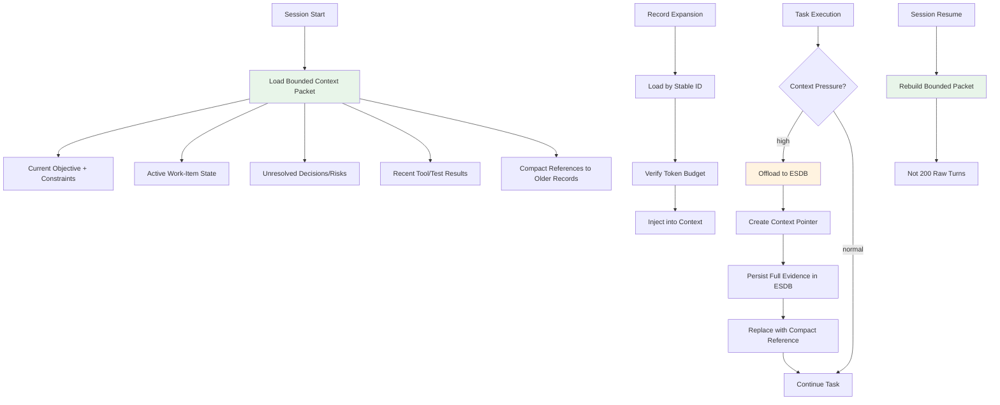
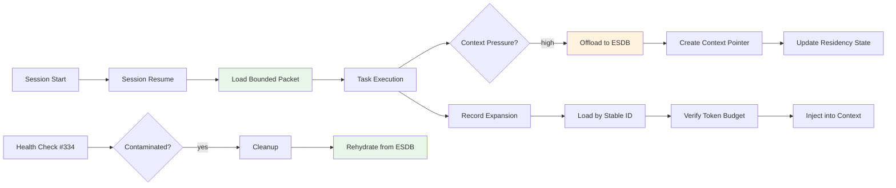

# ESDB-Backed Context Residency, Offloading, and Smart Rehydration

**Issue:** [#333](https://github.com/layer1labs/specsmith/issues/333)
**Phase:** Architectural decision record
**Status:** Proposed
**Dependencies:** #332 (predictive context-risk preflight)

## Overview

This document defines ESDB-backed context residency management that keeps only the minimum task-relevant working set in the LLM context while persisting important information durably. It replaces destructive eviction with non-destructive context-residency operations, implements smart retrieval with token budgets, and supports bounded session resume without injecting raw historical turns.



## Critical Boundary: Residency vs Evidence Lifecycle

**Context eviction must be separate from evidence lifecycle.**

| Operation | Effect on Durable Evidence | Effect on Context |
|---|---|---|
| Evict from context | No change | Removed from LLM context |
| Reference (pointer) | No change | Compact reference retained |
| Pin | No change | Always retained in context |
| Tombstone evidence | Marked as superseded | Removed from all views |
| Delete evidence | Deleted | Removed from all views |

**A record may be:**

- Durable and active in ESDB
- Resident in the current LLM context
- Referenced by a compact context pointer
- Temporarily suppressed from context
- Superseded or tombstoned only through explicit evidence-lifecycle action

**Removing a record from LLM context must never delete or tombstone the durable evidence record.**

## Required Components

### 1. Separate State Models

```python
@dataclass
class ESDBRecord:
    """Durable evidence record in ESDB."""
    id: str
    branch: str
    status: Literal["active", "superseded", "tombstoned"]
    content: str
    source_id: str | None
    provenance: str
    confidence: float
    created_at: str
    updated_at: str
    work_item_id: str | None
    requirement_ids: list[str]
    token_count: int

@dataclass
class ContextResidencyState:
    """Ephemeral context residency state."""
    record_id: str
    residency: Literal["resident", "referenced", "cold", "pinned", "stale", "excluded"]
    relevance_score: float  # 0.0-1.0 for current work item
    pin_status: bool  # Must remain in context
    last_loaded: str | None
    last_used: str | None
    token_cost: int
    source_id: str | None
    work_item_id: str | None
```

### 2. Context Index/View

ESDB context index marks records without modifying underlying evidence:

```sql
-- SQLite ESDB context index
CREATE TABLE IF NOT EXISTS context_index (
    record_id TEXT NOT NULL,
    branch TEXT NOT NULL DEFAULT 'main',
    residency TEXT NOT NULL CHECK(residency IN ('resident', 'referenced', 'cold', 'pinned', 'stale', 'excluded')),
    relevance_score REAL NOT NULL DEFAULT 0.0,
    pin_status INTEGER NOT NULL DEFAULT 0,
    last_loaded TEXT,
    last_used TEXT,
    token_cost INTEGER NOT NULL DEFAULT 0,
    PRIMARY KEY (record_id, branch)
);
```

### 3. Non-Destructive Eviction

Replace `_evict_low_confidence_records` with residency operation:

```python
def evict_from_context(
    record_ids: list[str],
    branch: str = "main",
) -> list[str]:
    """Remove records from LLM context without touching ESDB evidence.
    
    Sets residency to 'cold' in context_index.
    Does NOT modify ESDB record status.
    """
    for record_id in record_ids:
        cursor.execute(
            """UPDATE context_index
               SET residency = 'cold', last_used = ?
               WHERE record_id = ? AND branch = ?""",
            (now(), record_id, branch),
        )
    return record_ids
```

### 4. Smart Retrieval Ranking Model

Hybrid ranking considers multiple signals:

```python
def compute_relevance_score(
    record: ESDBRecord,
    context: RetrievalContext,
) -> float:
    """Compute relevance score for a record given current context."""
    score = 0.0
    
    # Work-item/requirement/test graph relationship (highest weight)
    if record.work_item_id == context.work_item_id:
        score += 3.0
    if any(req_id in context.active_requirements for req_id in record.requirement_ids):
        score += 2.0
    
    # Explicit pin/protect
    if record.pin_status:
        score += 5.0
    
    # Recency (decay over time)
    age_days = (now() - record.updated_at).days
    score += max(0, 1.0 - age_days / 30)
    
    # Semantic relevance (when available)
    if record.semantic_embedding:
        similarity = cosine_similarity(record.semantic_embedding, context.query_embedding)
        score += similarity * 2.0
    
    # Epistemic confidence
    score += record.confidence * 1.5
    
    # Source authority
    score += SOURCE_AUTHORITY_WEIGHTS.get(record.source_type, 0.5)
    
    # Unresolved/active status
    if record.status == "active":
        score += 1.0
    
    # Contradiction relevance
    if record.id in context.contradiction_ids:
        score += 2.0
    
    # Token cost penalty (prefer compact records when budget tight)
    if context.token_budget_remaining < record.token_count:
        score *= 0.5
    
    # Diversity/duplication penalty
    if record.is_duplicate_of_any(context.loaded_records):
        score *= 0.3
    
    return score
```

### 5. Token Budget Retrieval

```python
def retrieve_with_token_budget(
    work_item_id: str,
    token_budget: int,
    branch: str = "main",
) -> ContextPacket:
    """Retrieve records into a declared token budget, not fixed count.
    
    Includes fewer high-value records when they are large.
    """
    # Rank all candidate records
    candidates = rank_candidates(work_item_id, branch)
    
    selected = []
    tokens_used = 0
    
    for candidate in candidates:
        if tokens_used + candidate.token_count <= token_budget:
            selected.append(candidate)
            tokens_used += candidate.token_count
            # Update residency
            set_residency(candidate.id, "resident")
    
    return ContextPacket(
        work_item_id=work_item_id,
        records=selected,
        tokens_used=tokens_used,
        token_budget=token_budget,
        selection_reasons={r.id: f"relevance_score={r.relevance_score}" for r in selected},
    )
```

### 6. Context Pointers

Compact references with expand-on-demand:

```python
@dataclass
class ContextPointer:
    """Compact reference to an ESDB record."""
    record_id: str
    label: str
    compact_claims: list[str]  # Key facts, not full content
    provenance: str
    confidence: float
    token_cost_if_loaded: int
    
    def expand(self) -> ESDBRecord:
        """Load full record from ESDB by stable ID."""
        return load_record_by_id(self.record_id)
```

### 7. Agent-Callable Retrieval Operations

```
context search <query>              # Search by objective/query
context load <record-id>            # Load record by ID
context load-wi <wi-id>             # Load work-item bundle
context load-req <req-id>           # Load requirement/test evidence bundle
context explain <record-id>         # Explain why selected/omitted
context release <record-id>         # Release/unpin residency after task
context pin <record-id>             # Pin invariant to context
context unpin <record-id>           # Unpin
```

### 8. Pin Invariants

Records that must remain available during active work:

| Invariant Type | Example |
|---|---|
| Exact user constraints | "Do not modify files outside src/" |
| Accepted decisions | "Phase advanced to implementation" |
| Current proposal | Active proposal content |
| Active requirements | REQ-NNN records linked to work item |
| Critical risks | Unresolved risk records |
| Latest verified state | Last successful test/build result |

### 9. Bounded Prefetch

After proposal approval:

1. Load current objective and constraints
2. Load active work-item state
3. Load unresolved decisions/risks
4. Load compact references to older records
5. Do NOT load all historical turns

Incremental load only when task execution reaches a dependency.

### 10. Session Resume Packet

```json
{
  "work_item_id": "WI-NNN",
  "objective": "Implement feature X",
  "constraints": ["Do not modify Y", "Must pass test Z"],
  "accepted_decisions": ["Approve proposal v2"],
  "active_requirements": ["REQ-001", "REQ-002"],
  "checks_and_results": [
    {"test": "test_feature_x", "status": "pass", "timestamp": "..."}
  ],
  "open_risks": ["Risk: performance regression"],
  "next_action": "Write implementation",
  "resident_record_ids": ["rec-001", "rec-002"],
  "expandable_record_refs": [
    {
      "record_id": "rec-003",
      "label": "Previous test results",
      "compact_claims": ["test_a: pass, test_b: fail"],
      "confidence": 0.95
    }
  ],
  "token_budget": 50000,
  "packet_digest": "sha256:abc123..."
}
```

## Architecture

### Module Structure

```
src/specsmith/esdb/
    __init__.py
    sqlite_store.py        # SQLite ESDB backend (already has branch-awareness)
    context_index.py       # Context residency index operations
    residency.py           # ContextResidencyState management
    retrieval.py           # Smart retrieval with token budget
    ranking.py             # Hybrid ranking model
    pointers.py            # ContextPointer implementation
    session_resume.py      # Bounded session resume
    commands.py            # Agent/Zoo CLI commands
```

### Integration Points



## Context Packet Construction

### Bounded Resume Packet

When resuming a session:

1. Load current objective and approved proposal
2. Load exact user constraints
3. Load active work-item state
4. Load unresolved decisions/risks
5. Load recent relevant tool/test results (bounded, e.g., last 5)
6. Add compact references to older records
7. Add small bounded number of recent raw turns only when needed
8. Compute packet digest
9. Do NOT inject up to 200 raw historical turns

### Token Budget Allocation

```python
TOKEN_BUDGET_ALLOCATION = {
    "objective_and_constraints": 2000,      # Fixed allocation
    "active_requirements": 3000,            # Per requirement ~500
    "unresolved_risks": 1000,               # Per risk ~200
    "recent_results": 5000,                 # Last 5 results
    "resident_records": 10000,              # Variable
    "expandable_refs": 2000,                # Compact pointers
    "raw_turns": 5000,                      # Bounded, only when needed
    "overhead": 2000,                       # Metadata, digests
}
```

## Backend Parity

Both ChronoStore/ChronoMemory and SQLite ESDB backend must support equivalent residency semantics:

| Feature | SQLite | ChronoStore |
|---|---|---|
| Context index | `context_index` table | Equivalent view |
| Residency states | resident/referenced/cold/pinned/stale/excluded | Same states |
| Token tracking | `token_cost` column | Same |
| Stable IDs | UUID/v4 | Same |
| Provenance | `source_id` + `provenance` | Same |
| Branch-awareness | Composite PK `(id, branch)` | Same |

## Non-Goals

- Do not use ESDB as an excuse to omit exact active constraints from context
- Do not tombstone evidence merely because it is not currently relevant
- Do not blindly retrieve the highest-confidence records without task relevance
- Do not restore all historical conversation turns on every session resume
- Do not let semantic similarity override explicit work-item links or authoritative sources

## Acceptance Criteria

- [ ] Context eviction no longer deletes or tombstones durable ESDB evidence
- [ ] Session resume injects a bounded task-relevant packet rather than up to 200 raw turns
- [ ] Full evidence remains retrievable by stable IDs after offloading
- [ ] Retrieval respects a token budget and records why each item was selected
- [ ] Active constraints, decisions, requirements, risks, and next action are pinned
- [ ] Duplicate summaries/source records are not simultaneously loaded without justification
- [ ] Both ChronoStore and SQLite backends pass equivalent residency/retrieval tests
- [ ] Tests cover offload, rehydrate, pinning, stale records, contradictions, backend parity, unavailable semantic embeddings, and deterministic fallback ranking
- [ ] No important information is considered discarded solely because it left the model context

## Test Plan

| Test Module | Coverage |
|---|---|
| `tests/test_context_residency.py` | Residency state transitions, non-destructive eviction |
| `tests/test_context_retrieval.py` | Token budget retrieval, ranking model |
| `tests/test_context_pointers.py` | ContextPointer expand-on-demand |
| `tests/test_session_resume.py` | Bounded session resume, packet construction |
| `tests/test_context_pinning.py` | Pin/unpin invariants |
| `tests/test_backend_parity.py` | SQLite vs ChronoStore equivalence |
| `tests/test_context_dedup.py` | Duplicate detection and avoidance |

## Risks

| Risk | Mitigation |
|---|---|
| Ranking model favors recency over relevance | Weight work-item/requirement graph highest |
| Token budget estimation inaccurate | Use conservative estimates; monitor actual usage |
| Semantic embeddings unavailable | Fallback to deterministic ranking (graph, recency, confidence) |
| Context index grows unbounded | Prune cold records after configurable period |
| Session resume loses context | Verify packet digest; abort if critical invariants missing |

## Implementation Phases

### Phase 1: Fix Destructive Eviction
- Separate residency state from evidence lifecycle
- Replace `_evict_low_confidence_records` with non-destructive operation
- Add context_index table/view
- Tests for non-destructive eviction

### Phase 2: Smart Retrieval
- Hybrid ranking model implementation
- Token budget retrieval
- ContextPointer implementation
- Tests for ranking, budget, pointers

### Phase 3: Session Resume
- Bounded packet construction
- Pin invariants
- Bounded prefetch after proposal approval
- Tests for resume, pinning, prefetch

### Phase 4: Backend Parity and CLI
- ChronoStore residency semantics
- Agent/Zoo CLI commands
- Comprehensive test suite
- Backend parity tests

## Relationship to Other Issues

| Issue | Relationship |
|---|---|
| #332 (predictive context-risk preflight) | Context pressure and task-fit policy feed into retrieval |
| #334 (epistemic context-health checks) | Health checks operate