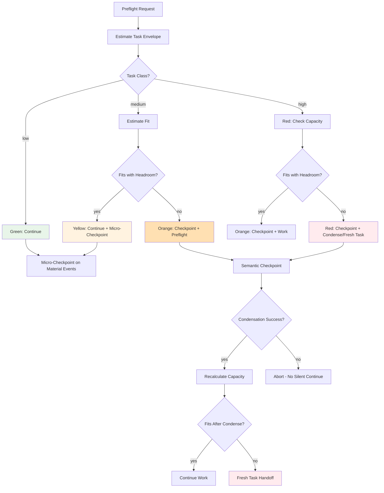
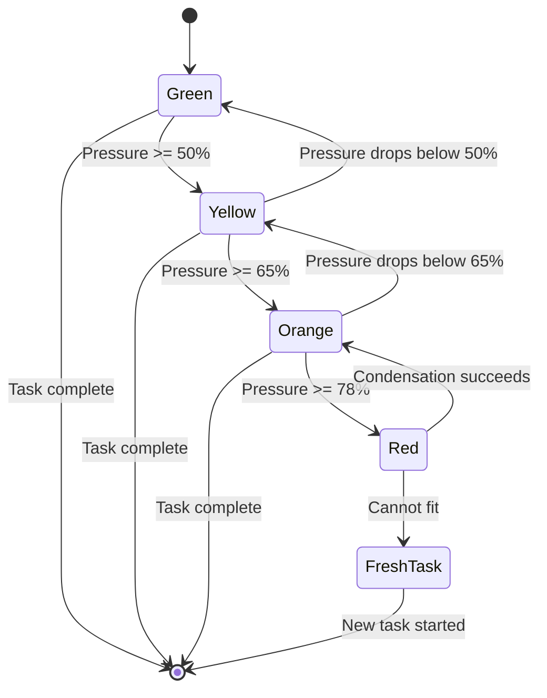
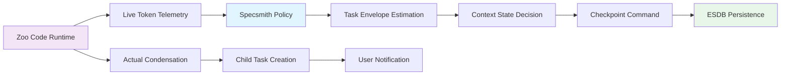
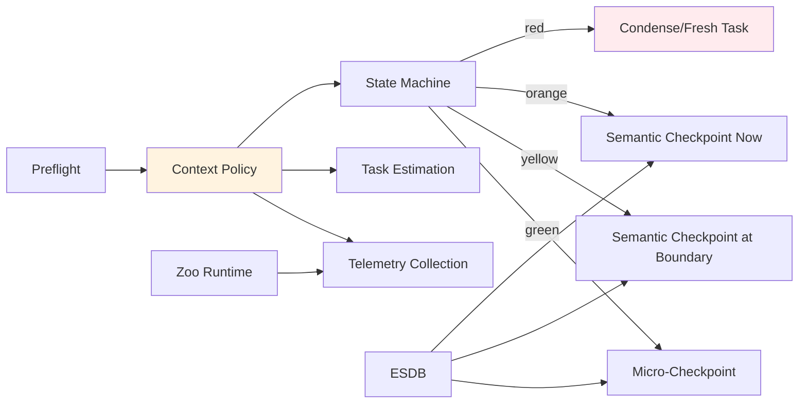

# Predictive Context-Risk Preflight and Dynamic Governance Checkpoint Policy

**Issue:** [#332](https://github.com/layer1labs/specsmith/issues/332)
**Phase:** Architectural decision record
**Status:** Proposed
**Dependencies:** None (prerequisite for #333 and #334)

## Overview

This document defines a dynamic context-risk controller that replaces fixed context-percentage-only behavior with intelligent decision-making. It determines when to micro-checkpoint, create semantic governance checkpoints, condense, or start a fresh Zoo task based on remaining context, task size, recent token growth, meaningful turns, material state changes, and uncertainty.



## Three Separate Concepts

### 1. Micro-Checkpoints (Cheap, Deterministic)

- No LLM summarization
- Persist current state to ESDB
- Triggered by material state changes
- Fast, frequent, safe

### 2. Semantic Governance Checkpoints (Expensive, Structured)

- Contain objective, constraints, decisions, evidence
- Created before condensation, handoff, risky operations
- Tamper-evident chain in ESDB
- Required before phase advance

### 3. Zoo Context Condensation (Token-Consuming)

- Actual LLM summarization of conversation
- Consumes model tokens
- Child-task creation in Zoo
- User-visible notification

## Context Telemetry Contract

```python
@dataclass
class ContextTelemetry:
    """Live context telemetry from Zoo/liteLLM."""
    
    # Model limits
    context_limit: int  # Total model context window
    reserved_output_tokens: int  # Reserved for model response
    safety_reserve: int  # Additional safety margin
    
    # Current usage
    current_input_tokens: int  # Current prompt/input tokens
    usable_remaining: int  # context_limit - current_input - output_reserve - safety_reserve
    
    # Compressed signals
    context_pressure: float  # 0.0-1.0, current_input / context_limit
    tokens_since_checkpoint: int  # Tokens since last checkpoint
    meaningful_turns_since_checkpoint: int  # Meaningful turns since checkpoint
    
    # History
    last_condensation_before_tokens: int | None
    last_condensation_after_tokens: int | None
```

## Task Envelope Estimation

```python
@dataclass
class TaskEnvelope:
    """Estimated resource requirements for a task."""
    
    # Task classification
    task_class: Literal["low", "medium", "high"]
    expected_meaningful_turns: int
    
    # Token estimates
    expected_reasoning_tokens: int  # Model reasoning/output
    expected_read_tokens: int  # File reads, tool results
    expected_tool_output_tokens: int  # Tool execution results
    expected_verification_tokens: int  # Test/build output
    
    # Uncertainty
    uncertainty_margin: float  # 0.25 = 25% margin
    
    # Computed
    @property
    def total_estimated_tokens(self) -> int:
        base = (
            self.expected_reasoning_tokens
            + self.expected_read_tokens
            + self.expected_tool_output_tokens
            + self.expected_verification_tokens
        )
        return int(base * (1 + self.uncertainty_margin))

def compute_remaining_work_capacity(telemetry: ContextTelemetry) -> int:
    """Compute remaining usable context after reserves."""
    return (
        telemetry.context_limit
        - telemetry.current_input_tokens
        - telemetry.reserved_output_tokens
        - telemetry.safety_reserve
        - CHECKPOINT_RESERVE  # Reserved for semantic checkpoint
    )

def task_fits(envelope: TaskEnvelope, capacity: int, min_headroom: int) -> bool:
    """Check if task fits with configured post-task headroom."""
    return envelope.total_estimated_tokens <= (capacity - min_headroom)
```

## Context States

### State Machine



### State Definitions

| State | Pressure | Action | Checkpoint |
|---|---|---|---|
| **Green** | < 50% | Continue normally | Micro-checkpoint on material events |
| **Yellow** | 50-65% | Continue with caution | Semantic checkpoint at natural boundary |
| **Orange** | 65-78% | Checkpoint before non-trivial work | Semantic checkpoint immediately |
| **Red** | >= 78% | Checkpoint, condense or fresh task | Semantic checkpoint immediately |

## Dynamic Checkpoint Policy

### Suggested Defaults (Configurable)

| Trigger | Threshold | Action |
|---|---|---|
| Yellow pressure | 50% usable capacity | Semantic checkpoint at next natural boundary |
| Orange pressure | 65% usable capacity | Semantic checkpoint immediately |
| Red pressure | 78% usable capacity | Semantic checkpoint + condense/fresh task |
| Token growth | 12% since checkpoint | Semantic checkpoint |
| Meaningful turns | 8-12 since checkpoint | Semantic checkpoint (starvation guard) |
| Material state changes | 5 changes | Micro-checkpoint |
| Failed attempts | 3 failures | Semantic checkpoint |
| Task uncertainty | 25% margin | Applied to all estimates |
| Post-task headroom | 20% minimum | Required before proceeding |
| Semantic checkpoint cooldown | 4 turns | Prevents excessive checkpoints |

### Meaningful Turns Definition

Counted as meaningful:

- Turns with substantive model reasoning
- Turns with file mutations or tool executions
- Turns with requirement/work-item state changes
- Turns with verification results

Not counted as meaningful:

- Approvals without additional work
- Empty acknowledgements
- Status-only messages
- Configuration queries

### Material Events Definition

Material events that trigger micro-checkpoints:

- Accepted decisions (preflight approvals)
- File mutations (writes, patches)
- Test results (pass/fail)
- Requirement state changes
- Scope changes
- Errors (any kind)
- Git commits
- Completed subtasks

## Preflight Decision Logic

```python
def preflight_decision(
    telemetry: ContextTelemetry,
    envelope: TaskEnvelope,
    config: CheckpointConfig,
) -> PreflightResult:
    """Decide whether to proceed, checkpoint, condense, or spawn fresh task."""
    
    capacity = compute_remaining_work_capacity(telemetry)
    fits = task_fits(envelope, capacity, config.min_post_task_headroom)
    
    pressure = telemetry.context_pressure
    
    # Determine state
    if pressure >= 0.78:
        state = ContextState.RED
    elif pressure >= 0.65:
        state = ContextState.ORANGE
    elif pressure >= 0.50:
        state = ContextState.YELLOW
    else:
        state = ContextState.GREEN
    
    # Decision logic
    if state == ContextState.GREEN:
        if fits:
            return PreflightResult(
                decision="proceed",
                state=state,
                action="micro-checkpoint on material events",
                diagnostics="Green state, task fits with headroom",
            )
        else:
            return PreflightResult(
                decision="checkpoint_first",
                state=ContextState.YELLOW,
                action="semantic checkpoint, then retry",
                diagnostics="Task envelope exceeds capacity, checkpoint may free space",
            )
    
    elif state == ContextState.YELLOW:
        if fits:
            return PreflightResult(
                decision="proceed",
                state=state,
                action="semantic checkpoint at natural boundary",
                diagnostics="Yellow state but task fits, checkpoint at boundary",
            )
        else:
            return PreflightResult(
                decision="checkpoint_and_recheck",
                state=ContextState.ORANGE,
                action="semantic checkpoint immediately, recheck fit",
                diagnostics="Task does not fit, checkpoint may help",
            )
    
    elif state == ContextState.ORANGE:
        if fits:
            return PreflightResult(
                decision="proceed_with_checkpoint",
                state=state,
                action="semantic checkpoint now, then proceed",
                diagnostics="Orange state, task fits after checkpoint",
            )
        else:
            return PreflightResult(
                decision="condense_or_fresh_task",
                state=ContextState.RED,
                action="semantic checkpoint, condense, or spawn fresh task",
                diagnostics="Task does not fit in orange state, need more space",
            )
    
    else:  # RED
        return PreflightResult(
            decision="fresh_task_required",
            state=state,
            action="semantic checkpoint, spawn fresh bounded task",
            diagnostics="Red state, insufficient capacity for task",
        )
```

## Zoo Integration Boundary



**Specsmith owns:**

- Policy decisions (green/yellow/orange/red)
- Task estimation logic
- Checkpoint schema
- Handoff requirements
- Post-condensation verification

**Zoo Code owns:**

- Accurate live token telemetry
- Model limits/reserves
- Actual condensation execution
- Child-task creation
- User-visible notifications

**Where Zoo lacks an agent-callable API:**

- Generate strongest supported settings/rules/commands
- Document upstream integration needed
- Do NOT fabricate telemetry from percentages when exact values available

## Post-Condensation Verification

```python
def verify_post_condensation(
    checkpoint: SemanticCheckpoint,
    telemetry_after: ContextTelemetry,
) -> VerificationResult:
    """Verify checkpoint survived condensation and recalculate capacity."""
    
    # 1. Verify checkpoint integrity
    if not checkpoint.verify():
        return VerificationResult(
            success=False,
            reason="Checkpoint integrity check failed",
            action="abort",
        )
    
    # 2. Recalculate available capacity
    new_capacity = compute_remaining_work_capacity(telemetry_after)
    
    # 3. Resume integrity check
    if new_capacity < MINIMUM_CAPACITY_THRESHOLD:
        return VerificationResult(
            success=False,
            reason=f"Insufficient capacity after condensation: {new_capacity}",
            action="spawn_fresh_task",
        )
    
    return VerificationResult(
        success=True,
        new_capacity=new_capacity,
        action="continue",
    )
```

## Fresh Task Handoff

When post-condensation capacity is insufficient:

```python
def spawn_fresh_task(
    parent_work_item: WorkItem,
    checkpoint: SemanticCheckpoint,
    telemetry: ContextTelemetry,
) -> FreshTaskSpec:
    """Generate bounded fresh-task handoff spec."""
    
    return FreshTaskSpec(
        parent_work_item_id=parent_work_item.id,
        objective=checkpoint.objective,
        constraints=checkpoint.constraints,
        active_requirements=checkpoint.active_requirements,
        open_risks=checkpoint.open_risks,
        next_action=checkpoint.next_action,
        resident_record_ids=checkpoint.resident_record_ids,
        expandable_refs=checkpoint.expandable_refs,
        token_budget=compute_fresh_task_budget(telemetry),
        parent_context_pressure=telemetry.context_pressure,
    )
```

## Dry-Run Diagnostics

Expose diagnostic mode explaining controller decisions:

```
specsmith context-preflight --dry-run
# Output:
# Context pressure: 62% (yellow)
# Task class: medium
# Estimated tokens: 15000
# Remaining capacity: 18000
# Post-task headroom: 19% (below 20% minimum)
# Decision: checkpoint_and_recheck
# Rationale: Task fits after semantic checkpoint, but headroom is tight
```

## Architecture

### Module Structure

```
src/specsmith/context/
    __init__.py
    telemetry.py       # ContextTelemetry dataclass, telemetry collection
    envelope.py        # TaskEnvelope estimation
    states.py          # Context state machine (green/yellow/orange/red)
    policy.py          # Dynamic checkpoint policy
    preflight.py       # Preflight decision logic
    checkpoints.py     # Micro-checkpoint and semantic checkpoint ops
    condensation.py    # Post-condensation verification
    handoff.py         # Fresh task handoff generation
    commands.py        # Agent/Zoo CLI commands
```

### Integration Points



## Non-Goals

- Do not checkpoint every fixed number of turns regardless of activity
- Do not use turn count as the primary context measurement
- Do not begin large repository reads before task-fit preflight
- Do not silently continue after failed or incomplete condensation
- Do not treat a Zoo file checkpoint as a semantic governance checkpoint

## Acceptance Criteria

- [ ] Medium/high proposals receive a task-fit decision before execution
- [ ] A simulated large task at approximately 70% context triggers checkpoint/condense or fresh-task handoff before broad work begins
- [ ] Small near-complete work is not interrupted unnecessarily at yellow pressure
- [ ] Micro-checkpoints require no LLM summarization call
- [ ] Semantic checkpoints occur at hard boundaries and are rate-limited elsewhere
- [ ] After condensation, capacity and checkpoint integrity are revalidated
- [ ] Insufficient post-condensation capacity creates a fresh bounded task rather than risking overflow
- [ ] Decisions are deterministic from captured telemetry/config and have actionable diagnostics
- [ ] Tests cover green/yellow/orange/red states, cooldown, hard-event overrides, estimation error, failed condensation, and child-task fallback

## Test Plan

| Test Module | Coverage |
|---|---|
| `tests/test_context_policy.py` | State machine transitions, policy decisions |
| `tests/test_task_envelope.py` | Task estimation, fit calculations |
| `tests/test_checkpoint_policy.py` | Micro-checkpoint triggers, semantic checkpoint timing |
| `tests/test_post_condensation.py` | Verification, capacity recalculation |
| `tests/test_fresh_task_handoff.py` | Handoff generation, bounded specs |
| `tests/test_meaningful_turns.py` | Turn counting logic |
| `tests/test_material_events.py` | Event detection, micro-checkpoint triggers |
| `tests/test_diagnostics.py` | Dry-run output, decision explanations |

## Risks

| Risk | Mitigation |
|---|---|
| Task envelope estimation inaccurate | Use 25% uncertainty margin; monitor actual vs estimated |
| Meaningful turn definition too strict/loose | Configurable thresholds; adjust based on telemetry |
| Zoo telemetry unavailable | Fall back to conservative estimates; document gap |
| Checkpoint overhead too high | Rate-limit semantic checkpoints; use micro-checkpoints frequently |
| Fresh task handoff loses context | Preserve full checkpoint; verify integrity after handoff |

## Implementation Phases

### Phase 1: Core State Machine and Telemetry
- `ContextTelemetry`