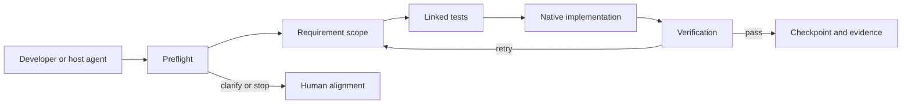
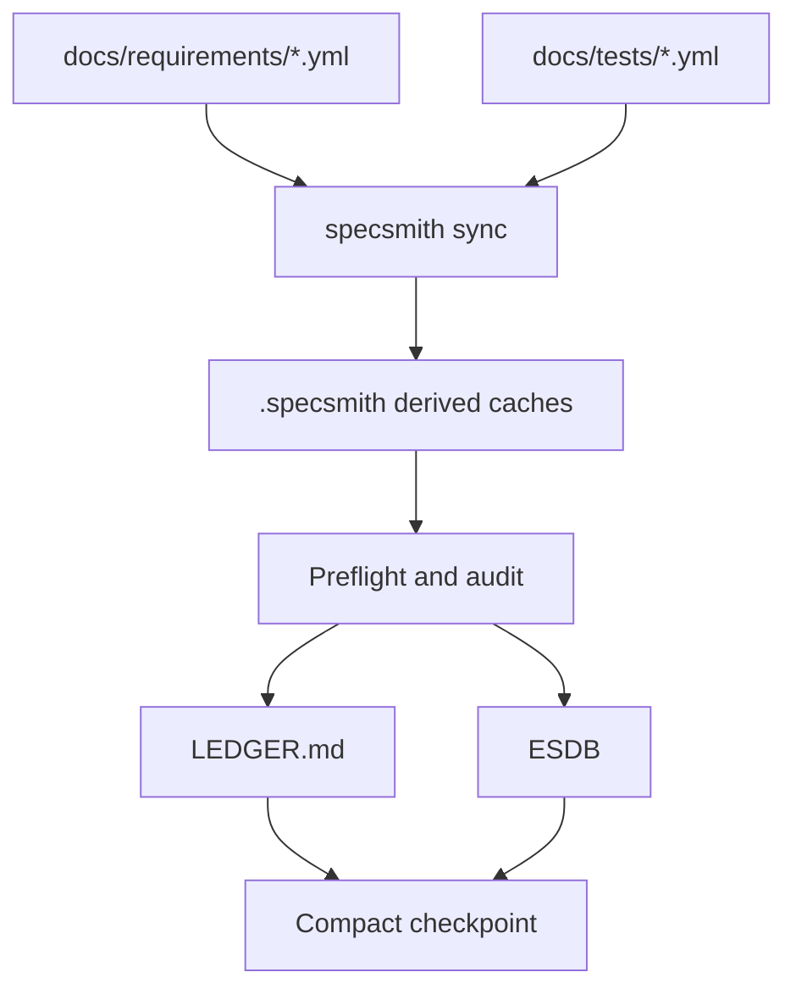
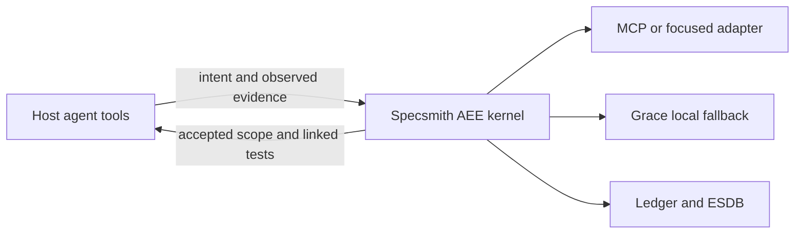

# Architecture diagrams

## Governed change loop

## Source-of-truth flow

## Integration boundary

The host owns code editing, Git, browsers, deployment, and framework skills.
Specsmith owns requirements, test traceability, epistemic boundaries, verification,
and durable evidence.
