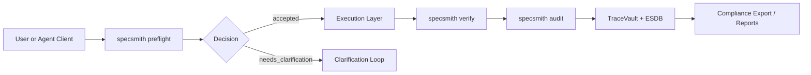
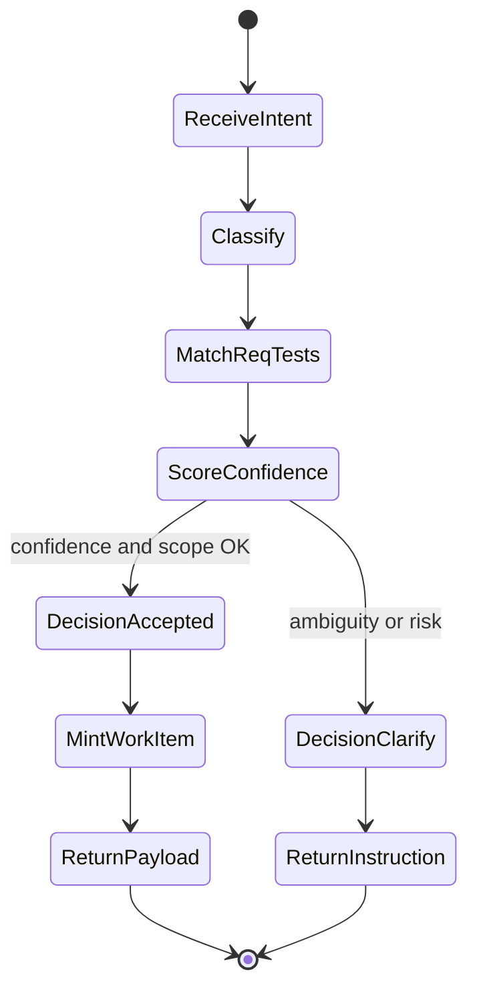
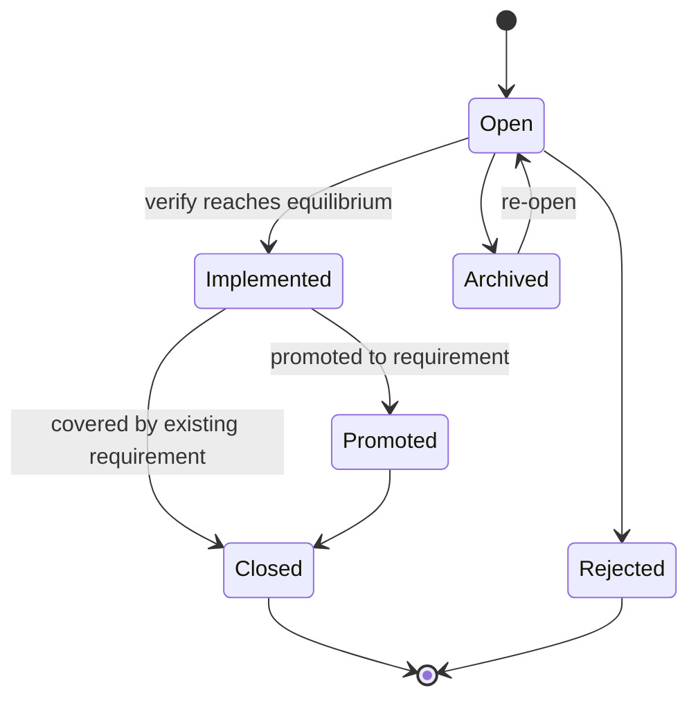
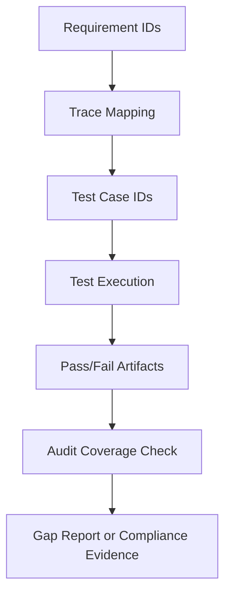
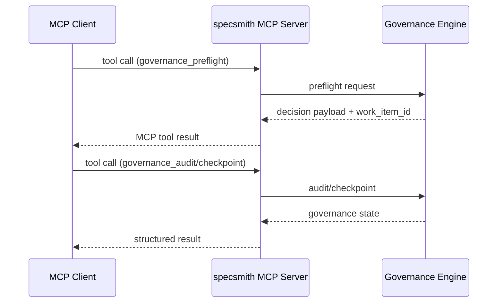
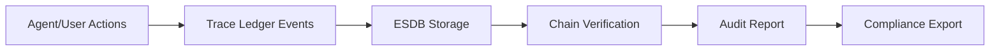
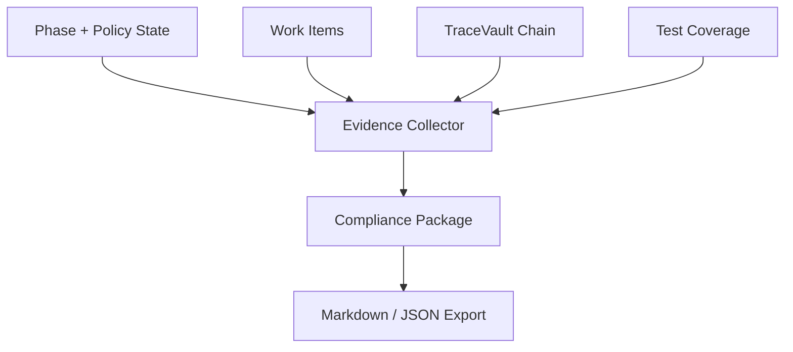
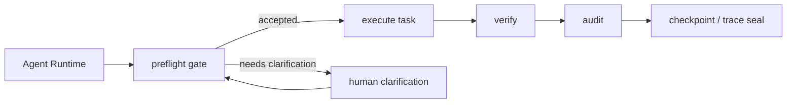

# Architecture and Workflow Diagrams
The diagrams below provide a visual reference for core specsmith governance paths.

## High-level architecture

## Preflight lifecycle

## Work-item lifecycle

## Requirements-to-tests traceability

## MCP integration flow

## ESDB and audit flow

## Compliance evidence generation

## Agent integration flow

