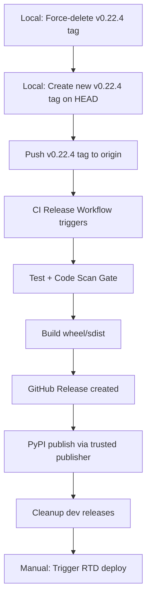

# v0.22.4 Release Plan

!!! danger "Historical record — do not execute"
    This plan predates the immutable fixed-point release process and is retained
    only as historical evidence. Follow `docs/site/releasing.md`; never move,
    replace, force-push, or reuse a published tag or package version.

## Current State

| Item | Status |
|------|--------|
| Governance Phase | Release (100% ready) |
| Audit Health | Healthy (82 passed, 0 failed) |
| Version in pyproject.toml | 0.22.4 |
| Version in `__init__.py` | 0.22.4 |
| Version in config.py | 0.22.4 |
| CHANGELOG latest | 0.22.3 (2026-07-14) |
| CI Status | Clean for main branch |
| v0.22.4 git tag | Exists locally - needs force re-tag |

## Release Workflow



## Step-by-Step Plan

### Step 1: Re-tag v0.22.4 locally

```bash
git tag -d v0.22.4
git tag -a v0.22.4 -m "Release v0.22.4" HEAD
```

### Step 2: Push tag to origin

```bash
git push origin v0.22.4
```

This triggers the [`release.yml`](.github/workflows/release.yml) workflow which:
- Runs tests, linting, mypy
- Runs code-scan-gate (blocks on High/Critical alerts)
- Builds wheel/sdist
- Creates GitHub Release
- Publishes to PyPI via trusted publisher (OIDC)
- Cleans up dev releases

### Step 3: Trigger ReadTheDocs Deployment

After PyPI publish succeeds, trigger the RTD workflow manually:

```bash
# Via GitHub UI: Actions > Deploy ReadTheDocs > Run workflow
# Or via CLI:
gh workflow run rtd-deploy.yml -f build_stable=true -f build_latest=true
```

The [`rtd-deploy.yml`](.github/workflows/rtd-deploy.yml) workflow:
- Configures RTD project source
- Synchronizes versions
- Triggers stable build
- Verifies latest tracks main
- Triggers latest build

### Step 4: Update README.md with v0.22.4 Release Notes

Add a v0.22.4 entry to the README release notes section (after line 77, before v0.20.0):

```markdown
**v0.22.4** - Patch release for v0.22.3 addressing save metrics timing, RTD deployment reliability, environment-only preflight handling, and help-side-effect fixes.
```

### Step 5: Update CHANGELOG.md

Add a v0.22.4 section under `[Unreleased]`:

```markdown
## [0.22.4] - 2026-07-15

### Changed
- Version bump to 0.22.4

### Fixed
- (Include any v0.22.4-specific fixes if applicable)
```

### Step 6: Update pyproject.toml Keywords/Tags

Review and update the `keywords` and `classifiers` sections in [`pyproject.toml`](pyproject.toml:15-36) to ensure they reflect v0.22.4 features. Current keywords include:
- agentic, scaffold, governance, agents-md, cli
- epistemic-engineering, belief-artifacts, stress-testing
- certainty, trace-vault, aee, knowledge-engineering
- fpga, hdl, vhdl, execution-profiles, tool-installer
- llm, ollama, requirements-management

### Step 7: Seal Release Milestone

Create a governance seal for the v0.22.4 release:

```bash
specsmith seal --seal-type milestone --description "v0.22.4 release published to PyPI and GitHub"
```

## Files to Modify

| File | Change |
|------|--------|
| (local git) | Force-delete and re-create v0.22.4 tag |
| README.md | Add v0.22.4 release notes entry |
| CHANGELOG.md | Add v0.22.4 section under Unreleased |
| pyproject.toml | Review keywords/classifiers (if needed) |
| .specsmith/ | Seal release milestone |

## Pre-Flight Checklist

- [x] Governance audit healthy
- [x] All 414 requirements have test coverage
- [x] Release phase at 100% readiness
- [x] CI clean on main branch
- [x] Version consistent across pyproject.toml, __init__.py, config.py
- [ ] v0.22.4 tag re-created locally
- [ ] v0.22.4 tag pushed to origin
- [ ] PyPI publish confirmed
- [ ] RTD deployment triggered
- [ ] README updated with v0.22.4 notes
- [ ] CHANGELOG updated with v0.22.4 section
- [ ] Release milestone sealed
